# Interactive BDUF Orchestrator - Implementation Progress
📅 **Last Updated**: 2025-06-01 | **Version**: 1.0.0

## Overall Progress: Phase 1 Foundation Complete ✅

## Implementation Status by Phase

## Detailed Component Status

```mermaid
graph TD
    A[Interactive BDUF Orchestrator] --> B[Phase 1: Foundation ✅]
    A --> C[Phase 2: BDUF Analysis 🔄]
    A --> D[Phase 3: Collaboration 📋]
    A --> E[Phase 4: Advanced Features 📋]
    
    B --> B1[✅ Error Handling Framework]
    B --> B2[✅ Utility Functions Library]
    B --> B3[✅ Constants and Enums]
    B --> B4[✅ Metrics Collection Framework]
    B --> B5[✅ CI/CD Pipeline Setup]
    B --> B6[✅ Database Schema Design]
    B --> B7[✅ Core Data Models]
    B --> B8[✅ MCP Server Implementation]
    B --> B9[✅ Authentication & Authorization]
    B --> B10[✅ Core MCP Tools Setup]
    
    C --> C1[🔄 NLP Processing Framework]
    C --> C2[📋 Requirements Analysis Tools]
    C --> C3[📋 Architecture Pattern Library]
    C --> C4[📋 Architecture Option Generation]
    C --> C5[📋 Technology Assessment Engine]
    C --> C6[📋 Context7 & Perplexity Integration]
    C --> C7[📋 Risk Analysis Framework]
    C --> C8[📋 BDUF Analysis Integration]
    
    D --> D1[📋 WebSocket Server Implementation]
    D --> D2[📋 Collaboration Session Management]
    D --> D3[📋 Approval Engine Implementation]
    D --> D4[📋 Interactive Approval Tools]
    D --> D5[📋 Collaborative Document Editor]
    D --> D6[📋 Documentation Tools]
    D --> D7[📋 Notification Framework]
    D --> D8[📋 Collaboration Integration]
    
    E --> E1[📋 Task Decomposition Engine]
    E --> E2[📋 Context Assembly Engine]
    E --> E3[📋 Adaptive Planning Engine]
    E --> E4[📋 Execution Monitoring Tools]
    E --> E5[📋 Quality Assurance Engine]
    E --> E6[📋 Monitoring & Observability]
    E --> E7[📋 Security & Compliance]
    E --> E8[📋 Production Deployment]
    
    style B fill:#90EE90
    style B1 fill:#90EE90
    style B2 fill:#90EE90
    style B3 fill:#90EE90
    style B4 fill:#90EE90
    style B5 fill:#90EE90
    style B6 fill:#90EE90
    style B7 fill:#90EE90
    style B8 fill:#90EE90
    style B9 fill:#90EE90
    style B10 fill:#90EE90
    style C1 fill:#FFD700
    style C2 fill:#E6E6FA
    style C3 fill:#E6E6FA
    style C4 fill:#E6E6FA
    style C5 fill:#E6E6FA
    style C6 fill:#E6E6FA
    style C7 fill:#E6E6FA
    style C8 fill:#E6E6FA
    style D1 fill:#E6E6FA
    style D2 fill:#E6E6FA
    style D3 fill:#E6E6FA
    style D4 fill:#E6E6FA
    style D5 fill:#E6E6FA
    style D6 fill:#E6E6FA
    style D7 fill:#E6E6FA
    style D8 fill:#E6E6FA
    style E1 fill:#E6E6FA
    style E2 fill:#E6E6FA
    style E3 fill:#E6E6FA
    style E4 fill:#E6E6FA
    style E5 fill:#E6E6FA
    style E6 fill:#E6E6FA
    style E7 fill:#E6E6FA
    style E8 fill:#E6E6FA
    style C fill:#E6E6FA
    style D fill:#E6E6FA
    style E fill:#E6E6FA
```

## Phase 1 Architecture Overview

**Legend**: 🟢 **Completed Components** | 🟣 **Pending Phases**

## Implementation Milestones

| Phase | Milestone | Status | Completion |
|-------|-----------|--------|------------|
| **Phase 1** | **Foundation & Infrastructure** | ✅ **Complete** | **100%** |
| 1.1 | Core Infrastructure Setup | ✅ Complete | 100% |
| 1.2 | Database Infrastructure | ✅ Complete | 100% |
| 1.3 | MCP Server Framework | ✅ Complete | 100% |
| 1.4 | Basic Tool Implementation | ✅ Complete | 100% |
| **Phase 2** | **BDUF Analysis Engine** | 🔄 **Next** | **0%** |
| 2.1 | Requirements Analysis Engine | 📋 Pending | 0% |
| 2.2 | Architecture Generation Engine | 📋 Pending | 0% |
| 2.3 | Technology Evaluation Framework | 📋 Pending | 0% |
| 2.4 | Risk Assessment Engine | 📋 Pending | 0% |
| **Phase 3** | **Interactive Collaboration Framework** | 📋 **Pending** | **0%** |
| 3.1 | Real-time Collaboration Infrastructure | 📋 Pending | 0% |
| 3.2 | Approval Workflow System | 📋 Pending | 0% |
| 3.3 | Interactive Documentation System | 📋 Pending | 0% |
| 3.4 | Communication and Notification System | 📋 Pending | 0% |
| **Phase 4** | **Advanced Orchestration & Production** | 📋 **Pending** | **0%** |
| 4.1 | Task Decomposition and Context Assembly | 📋 Pending | 0% |
| 4.2 | Adaptive Planning and Learning | 📋 Pending | 0% |
| 4.3 | Quality Assurance and Monitoring | 📋 Pending | 0% |
| 4.4 | Production Readiness and Deployment | 📋 Pending | 0% |

## Legend
- ✅ **Complete**: Implementation finished and tested
- 🔄 **In Progress**: Currently being implemented
- 📋 **Pending**: Ready for implementation with detailed prompts
- ⏸️ **Blocked**: Waiting for dependencies

## Next Steps

**🎯 Ready to Begin**: Phase 2 BDUF Analysis Engine
- All Phase 1 foundation components are complete
- Implementation prompts 011-018 are ready for Phase 2 (see mapping below)
- Database schema and MCP tools provide the foundation for analysis capabilities
- Context7 and Perplexity integration patterns are established

### Phase 2 Implementation Prompt Mapping
| Prompt | Component | Description |
|--------|-----------|-------------|
| 011 | NLP Processing Framework | Natural language processing for requirements |
| 012 | Requirements Analysis Tools | Automated requirement analysis and validation |
| 013 | Architecture Pattern Library | Design pattern catalog and recommendations |
| 014 | Architecture Option Generation | AI-powered architecture alternatives |
| 015 | Technology Assessment Engine | Technology stack evaluation framework |
| 016 | Context7 & Perplexity Integration | External research and documentation |
| 017 | Risk Analysis Framework | Comprehensive risk assessment system |
| 018 | BDUF Analysis Integration | Complete analysis workflow orchestration |

**📊 Overall Progress**: 10/34 major components complete (29.4%)