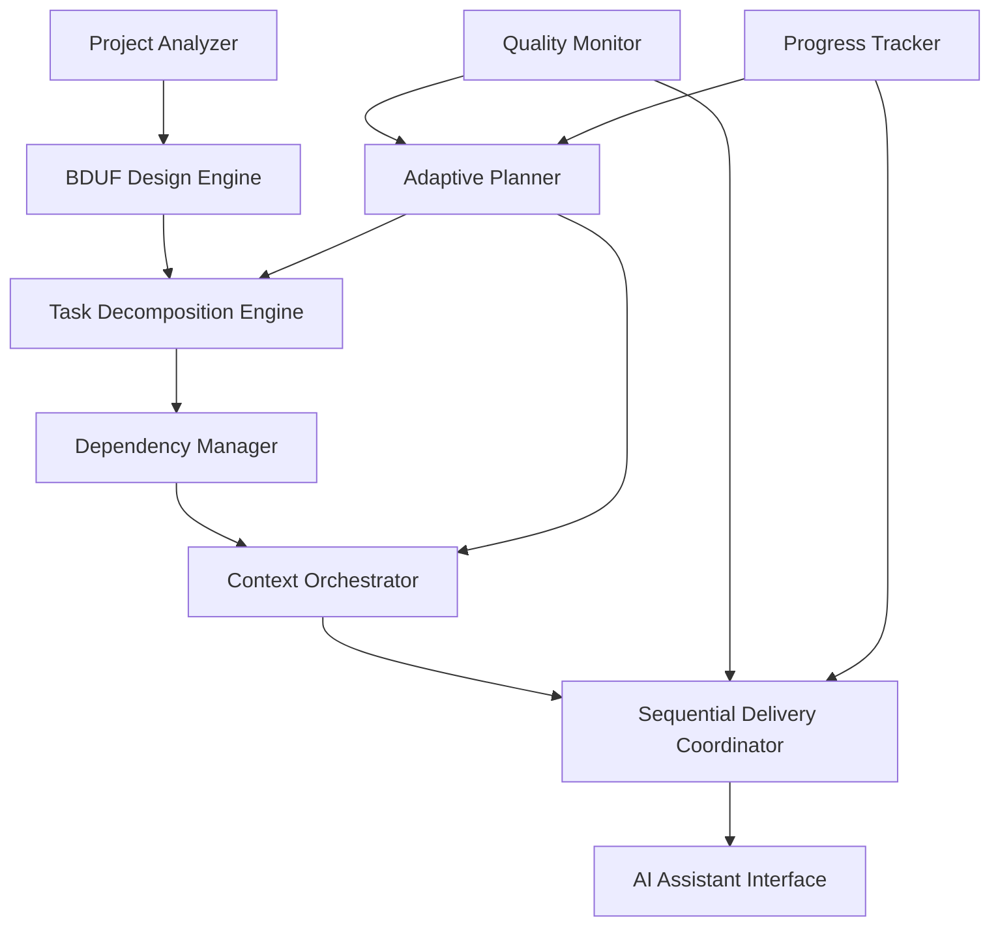

# BDUF Orchestrator MCP Server: Comprehensive Architecture & Design

## Executive Summary

This document presents the design for a revolutionary Model Context Protocol (MCP) server that combines Big Design Up Front (BDUF) methodology with AI task orchestration. The BDUF Orchestrator MCP Server performs comprehensive upfront project planning, decomposes work into manageable tasks, and delivers contextualized work packages sequentially to AI coding assistants.

## Vision & Strategic Value

### The Paradigm Shift
Traditional AI coding assistants work reactively, responding to individual requests without comprehensive project understanding. The BDUF Orchestrator represents a paradigm shift to **proactive AI project management** that:

1. **Plans comprehensively** before implementation begins
2. **Orchestrates systematically** through proper task sequencing
3. **Delivers contextually** with optimal preparation for each task
4. **Adapts intelligently** as discoveries emerge during implementation

### Strategic Benefits
- **Architectural Coherence**: Maintains design integrity across all implementation work
- **Risk Mitigation**: Identifies and resolves conflicts before implementation
- **Resource Optimization**: Eliminates rework and ensures efficient task progression
- **Quality Assurance**: Each task includes comprehensive context and validation criteria
- **Predictable Delivery**: Clear roadmaps with dependency-aware scheduling

## Research Foundations

### 1. Big Design Up Front (BDUF) Integration

#### BDUF Principles Applied
- **Comprehensive Early Design**: Complete system architecture before coding begins
- **Documentation-Focused**: Thorough documentation guides all implementation
- **Risk Mitigation**: Resolve architectural decisions upfront to prevent costly changes
- **Significant Decisions**: Focus on choices that are expensive to change later

#### Modern BDUF Application
- **Architectural Decision Records (ADRs)**: Document critical technology and design choices
- **Trade-off Analysis**: Explicit documentation of architectural alternatives and rationale
- **Technology Stack Selection**: Systematic evaluation and selection of development tools
- **Interface Design First**: API contracts and component boundaries defined before implementation

### 2. Task Decomposition Methodologies

#### Hierarchical Decomposition Patterns
- **Top-Down Approach**: Project goals broken into progressively smaller work units
- **Functional Decomposition**: Tasks organized by system functions and features
- **Object-Oriented Decomposition**: Structure aligned with system components and modules
- **Vertical vs Horizontal**: Balance between end-to-end features and specialized work

#### AI-Enabled Decomposition
- **Automated WBS Generation**: LLMs can systematically break down specifications
- **Dependency Inference**: AI tools identify logical task dependencies
- **Estimation Automation**: Historical data and task similarity enable effort prediction
- **Critical Path Calculation**: Automated identification of timeline-critical tasks

### 3. Sequential Task Orchestration

#### Modern Orchestration Patterns
- **Workflow Orchestration**: Structured task organization with dependency management
- **Dynamic Queue Management**: Adaptive task prioritization based on context and resources
- **Sequential Processing**: Maintaining state and memory across task sequences
- **Role-Based Coordination**: Specialized AI agents for different task types

#### Coordination Mechanisms
- **LLM-as-a-Judge**: Dedicated evaluation and decision-making for task progression
- **Tool-Using Agents**: Automated interaction with external systems and APIs
- **Reflection Loops**: Recursive refinement and quality improvement cycles
- **Progress Tracking**: Comprehensive monitoring and adaptation capabilities

### 4. Adaptive Planning Integration

#### Hybrid Planning Approach
- **Speculative Planning**: High-level goals with acknowledgment of uncertainty
- **Continuous Collaboration**: Regular stakeholder involvement and feedback loops
- **Rolling Wave Planning**: Detailed planning for near-term, high-level for future phases
- **Learning-Oriented Cycles**: Systematic incorporation of implementation discoveries

#### Change Management
- **Dynamic Backlogs**: Living task lists that adapt to new information
- **Continuous Replanning**: Regular reassessment and plan adjustment
- **Feedback Integration**: Structured mechanisms for incorporating learning
- **Vision Anchoring**: Maintaining coherence through shared goals and direction

## System Architecture

### Core Components Overview



### 1. Project Analyzer
**Purpose**: Comprehensive analysis of project requirements and constraints

```typescript
interface ProjectAnalyzer {
  analyzeRequirements(requirements: ProjectRequirements): RequirementAnalysis;
  assessComplexity(requirements: ProjectRequirements): ComplexityAssessment;
  identifyConstraints(requirements: ProjectRequirements): ProjectConstraints;
  extractStakeholders(requirements: ProjectRequirements): StakeholderMap;
}

interface RequirementAnalysis {
  functionalRequirements: FunctionalRequirement[];
  nonFunctionalRequirements: NonFunctionalRequirement[];
  businessRules: BusinessRule[];
  integrationPoints: IntegrationPoint[];
  qualityAttributes: QualityAttribute[];
  riskFactors: RiskFactor[];
}

interface ComplexityAssessment {
  technicalComplexity: 'low' | 'medium' | 'high' | 'expert';
  integrationComplexity: 'simple' | 'moderate' | 'complex' | 'enterprise';
  dataComplexity: 'basic' | 'structured' | 'complex' | 'big_data';
  uiComplexity: 'minimal' | 'standard' | 'rich' | 'advanced';
  estimatedEffort: EffortEstimate;
  confidenceLevel: number;
}
```

### 2. BDUF Design Engine
**Purpose**: Comprehensive upfront design and architecture planning

```typescript
interface BDUFDesignEngine {
  generateSystemArchitecture(analysis: RequirementAnalysis): SystemArchitecture;
  selectTechnologyStack(architecture: SystemArchitecture): TechnologyStack;
  designComponentInterfaces(architecture: SystemArchitecture): InterfaceDesign[];
  createArchitecturalDecisions(architecture: SystemArchitecture): ArchitecturalDecision[];
  generateDesignDocumentation(architecture: SystemArchitecture): DesignDocumentation;
}

interface SystemArchitecture {
  overallDesign: ArchitecturalPattern;
  componentStructure: Component[];
  dataArchitecture: DataModel;
  securityArchitecture: SecurityDesign;
  deploymentArchitecture: DeploymentModel;
  integrationArchitecture: IntegrationDesign;
  qualityArchitecture: QualityStrategy;
}

interface ArchitecturalDecision {
  id: string;
  title: string;
  context: string;
  decision: string;
  alternatives: Alternative[];
  consequences: Consequence[];
  status: 'proposed' | 'accepted' | 'deprecated' | 'superseded';
  rationale: string;
  implications: string[];
}
```

### 3. Task Decomposition Engine
**Purpose**: Break down architecture into implementable work units

```typescript
interface TaskDecompositionEngine {
  generateWorkBreakdown(architecture: SystemArchitecture): WorkBreakdownStructure;
  decomposeToTasks(wbs: WorkBreakdownStructure): ImplementationTask[];
  estimateEffort(tasks: ImplementationTask[]): TaskEstimate[];
  categorizeByType(tasks: ImplementationTask[]): TaskCategory[];
  optimizeTaskGranularity(tasks: ImplementationTask[]): ImplementationTask[];
}

interface WorkBreakdownStructure {
  hierarchyLevels: WBSLevel[];
  taskCategories: TaskCategory[];
  deliverables: Deliverable[];
  milestones: Milestone[];
  qualityGates: QualityGate[];
}

interface ImplementationTask {
  id: string;
  title: string;
  description: string;
  category: TaskType;
  complexity: ComplexityLevel;
  estimatedEffort: EffortEstimate;
  requiredSkills: Skill[];
  deliverables: Deliverable[];
  acceptanceCriteria: AcceptanceCriterion[];
  qualityRequirements: QualityRequirement[];
  riskFactors: TaskRisk[];
}

enum TaskType {
  ARCHITECTURE_SETUP = 'architecture_setup',
  COMPONENT_IMPLEMENTATION = 'component_implementation',
  INTEGRATION_DEVELOPMENT = 'integration_development',
  DATABASE_IMPLEMENTATION = 'database_implementation',
  API_DEVELOPMENT = 'api_development',
  UI_IMPLEMENTATION = 'ui_implementation',
  TESTING_IMPLEMENTATION = 'testing_implementation',
  DEPLOYMENT_SETUP = 'deployment_setup',
  DOCUMENTATION = 'documentation',
  QUALITY_ASSURANCE = 'quality_assurance'
}
```

### 4. Dependency Manager
**Purpose**: Analyze and manage task dependencies and sequencing

```typescript
interface DependencyManager {
  analyzeDependencies(tasks: ImplementationTask[]): DependencyGraph;
  calculateCriticalPath(graph: DependencyGraph): CriticalPath;
  generateTaskSequence(graph: DependencyGraph): TaskSequence;
  identifyParallelOpportunities(sequence: TaskSequence): ParallelGroup[];
  validateDependencyIntegrity(graph: DependencyGraph): ValidationResult;
}

interface DependencyGraph {
  nodes: TaskNode[];
  edges: DependencyEdge[];
  clusters: TaskCluster[];
  criticalPath: TaskNode[];
  parallelGroups: ParallelGroup[];
}

interface DependencyEdge {
  from: string; // task id
  to: string;   // task id
  type: DependencyType;
  strength: 'hard' | 'soft' | 'preferred';
  rationale: string;
  constraints: Constraint[];
}

enum DependencyType {
  FINISH_TO_START = 'finish_to_start',
  START_TO_START = 'start_to_start',
  FINISH_TO_FINISH = 'finish_to_finish',
  START_TO_FINISH = 'start_to_finish',
  INFORMATION_DEPENDENCY = 'information_dependency',
  RESOURCE_DEPENDENCY = 'resource_dependency'
}
```

### 5. Context Orchestrator
**Purpose**: Prepare optimal context packages for each task

```typescript
interface ContextOrchestrator {
  prepareTaskContext(
    task: ImplementationTask,
    architecture: SystemArchitecture,
    dependencies: TaskDependency[]
  ): TaskContextPackage;
  
  generatePersona(task: ImplementationTask): ExpertPersona;
  assembleDocumentation(task: ImplementationTask): TechnicalDocumentation;
  createGuidance(task: ImplementationTask): ImplementationGuidance;
  prepareValidation(task: ImplementationTask): ValidationPackage;
}

interface TaskContextPackage {
  taskDefinition: TaskDefinition;
  expertPersona: ExpertPersona;
  technicalContext: TechnicalContext;
  implementationGuidance: ImplementationGuidance;
  qualityFramework: QualityFramework;
  validationPackage: ValidationPackage;
  progressTracking: ProgressTracker;
  metadata: ContextMetadata;
}

interface ImplementationGuidance {
  approach: string;
  designPatterns: DesignPattern[];
  codeExamples: CodeExample[];
  bestPractices: BestPractice[];
  commonPitfalls: Pitfall[];
  testingStrategy: TestingStrategy;
  reviewCriteria: ReviewCriterion[];
  successMetrics: SuccessMetric[];
}
```

### 6. Sequential Delivery Coordinator
**Purpose**: Manage task delivery and AI assistant coordination

```typescript
interface SequentialDeliveryCoordinator {
  initializeDeliveryPlan(sequence: TaskSequence): DeliveryPlan;
  getNextTask(currentState: ProjectState): NextTaskPackage | null;
  handleTaskCompletion(
    taskId: string, 
    result: TaskResult
  ): CompletionResponse;
  coordinateParallelTasks(tasks: ImplementationTask[]): CoordinationPlan;
  adaptToChanges(changes: ProjectChange[]): AdaptationPlan;
}

interface NextTaskPackage {
  task: ImplementationTask;
  contextPackage: TaskContextPackage;
  deliveryInstructions: DeliveryInstructions;
  coordinationInfo: CoordinationInfo;
  progressExpectations: ProgressExpectations;
}

interface DeliveryInstructions {
  priority: 'critical' | 'high' | 'normal' | 'low';
  timeframe: TimeFrame;
  qualityGates: QualityGate[];
  reportingRequirements: ReportingRequirement[];
  collaborationNeeds: CollaborationNeed[];
  escalationCriteria: EscalationCriterion[];
}
```

### 7. Adaptive Planner
**Purpose**: Continuous plan refinement and adaptation

```typescript
interface AdaptivePlanner {
  assessPlanHealth(
    currentPlan: DeliveryPlan,
    progress: ProjectProgress
  ): PlanHealthAssessment;
  
  identifyAdaptationNeeds(
    discoveries: Discovery[],
    blockers: Blocker[]
  ): AdaptationNeed[];
  
  generatePlanUpdates(
    adaptationNeeds: AdaptationNeed[]
  ): PlanUpdate[];
  
  validatePlanCoherence(
    updatedPlan: DeliveryPlan
  ): CoherenceValidation;
  
  optimizePlan(plan: DeliveryPlan): OptimizedPlan;
}

interface Discovery {
  source: 'implementation' | 'testing' | 'integration' | 'stakeholder';
  type: 'requirement_change' | 'technical_constraint' | 'opportunity' | 'risk';
  impact: 'low' | 'medium' | 'high' | 'critical';
  description: string;
  implications: string[];
  suggestedActions: Action[];
}
```

### 8. Quality Monitor
**Purpose**: Continuous quality assessment and improvement

```typescript
interface QualityMonitor {
  assessTaskQuality(
    taskResult: TaskResult,
    qualityFramework: QualityFramework
  ): QualityAssessment;
  
  validateArchitecturalCoherence(
    implementations: Implementation[],
    architecture: SystemArchitecture
  ): CoherenceReport;
  
  identifyQualityTrends(
    assessments: QualityAssessment[]
  ): QualityTrend[];
  
  recommendImprovements(
    trends: QualityTrend[]
  ): ImprovementRecommendation[];
}
```

## MCP Server Interface Design

### Tool Definitions

```typescript
const bdufOrchestratorTools = [
  {
    name: 'analyze_project',
    description: 'Perform comprehensive BDUF analysis of project requirements',
    inputSchema: {
      type: 'object',
      properties: {
        requirements: { type: 'string' },
        constraints: { type: 'object', optional: true },
        stakeholders: { type: 'array', optional: true },
        preferences: { type: 'object', optional: true }
      },
      required: ['requirements']
    }
  },
  {
    name: 'generate_architecture',
    description: 'Create comprehensive system architecture and design',
    inputSchema: {
      type: 'object',
      properties: {
        analysis: { type: 'object' },
        designPreferences: { type: 'object', optional: true }
      },
      required: ['analysis']
    }
  },
  {
    name: 'decompose_to_tasks',
    description: 'Break down architecture into implementable tasks',
    inputSchema: {
      type: 'object',
      properties: {
        architecture: { type: 'object' },
        granularityLevel: { type: 'string', optional: true },
        taskTypes: { type: 'array', optional: true }
      },
      required: ['architecture']
    }
  },
  {
    name: 'get_next_task',
    description: 'Retrieve next task in sequence with full context package',
    inputSchema: {
      type: 'object',
      properties: {
        projectId: { type: 'string' },
        currentState: { type: 'object', optional: true }
      },
      required: ['projectId']
    }
  },
  {
    name: 'complete_task',
    description: 'Report task completion and receive next instructions',
    inputSchema: {
      type: 'object',
      properties: {
        taskId: { type: 'string' },
        result: { type: 'object' },
        discoveries: { type: 'array', optional: true },
        issues: { type: 'array', optional: true }
      },
      required: ['taskId', 'result']
    }
  },
  {
    name: 'adapt_plan',
    description: 'Update plan based on discoveries and changes',
    inputSchema: {
      type: 'object',
      properties: {
        projectId: { type: 'string' },
        changes: { type: 'array' },
        adaptationType: { type: 'string', optional: true }
      },
      required: ['projectId', 'changes']
    }
  },
  {
    name: 'get_project_status',
    description: 'Retrieve comprehensive project status and progress',
    inputSchema: {
      type: 'object',
      properties: {
        projectId: { type: 'string' },
        detailLevel: { type: 'string', optional: true }
      },
      required: ['projectId']
    }
  }
];
```

### Workflow Implementation

```typescript
class BDUFOrchestratorMCPServer extends MCPServer {
  private projectAnalyzer: ProjectAnalyzer;
  private bdufEngine: BDUFDesignEngine;
  private decompositionEngine: TaskDecompositionEngine;
  private dependencyManager: DependencyManager;
  private contextOrchestrator: ContextOrchestrator;
  private deliveryCoordinator: SequentialDeliveryCoordinator;
  private adaptivePlanner: AdaptivePlanner;
  private qualityMonitor: QualityMonitor;
  private projectState: Map<string, ProjectState>;

  async handleToolCall(toolName: string, parameters: any): Promise<ToolResult> {
    switch (toolName) {
      case 'analyze_project':
        return await this.analyzeProject(parameters);
      case 'generate_architecture':
        return await this.generateArchitecture(parameters);
      case 'decompose_to_tasks':
        return await this.decomposeToTasks(parameters);
      case 'get_next_task':
        return await this.getNextTask(parameters);
      case 'complete_task':
        return await this.completeTask(parameters);
      case 'adapt_plan':
        return await this.adaptPlan(parameters);
      case 'get_project_status':
        return await this.getProjectStatus(parameters);
      default:
        throw new Error(`Unknown tool: ${toolName}`);
    }
  }

  private async analyzeProject(params: any): Promise<ProjectAnalysisResult> {
    // Comprehensive BDUF analysis
    const analysis = await this.projectAnalyzer.analyzeRequirements(params.requirements);
    const complexity = await this.projectAnalyzer.assessComplexity(params.requirements);
    const constraints = await this.projectAnalyzer.identifyConstraints(params.requirements);
    
    return {
      analysis,
      complexity,
      constraints,
      recommendations: await this.generateAnalysisRecommendations(analysis, complexity),
      riskAssessment: await this.assessProjectRisks(analysis, complexity),
      estimatedTimeline: await this.estimateProjectTimeline(complexity),
      resourceRequirements: await this.estimateResourceNeeds(analysis, complexity)
    };
  }

  private async generateArchitecture(params: any): Promise<ArchitectureResult> {
    // Comprehensive system design
    const architecture = await this.bdufEngine.generateSystemArchitecture(params.analysis);
    const techStack = await this.bdufEngine.selectTechnologyStack(architecture);
    const interfaces = await this.bdufEngine.designComponentInterfaces(architecture);
    const decisions = await this.bdufEngine.createArchitecturalDecisions(architecture);
    const documentation = await this.bdufEngine.generateDesignDocumentation(architecture);
    
    return {
      architecture,
      techStack,
      interfaces,
      decisions,
      documentation,
      implementationStrategy: await this.createImplementationStrategy(architecture),
      qualityStrategy: await this.defineQualityStrategy(architecture),
      riskMitigation: await this.createRiskMitigationPlan(architecture)
    };
  }

  private async decomposeToTasks(params: any): Promise<TaskDecompositionResult> {
    // Task breakdown and sequencing
    const wbs = await this.decompositionEngine.generateWorkBreakdown(params.architecture);
    const tasks = await this.decompositionEngine.decomposeToTasks(wbs);
    const estimates = await this.decompositionEngine.estimateEffort(tasks);
    
    const dependencies = await this.dependencyManager.analyzeDependencies(tasks);
    const criticalPath = await this.dependencyManager.calculateCriticalPath(dependencies);
    const sequence = await this.dependencyManager.generateTaskSequence(dependencies);
    
    return {
      workBreakdownStructure: wbs,
      tasks,
      estimates,
      dependencies,
      criticalPath,
      sequence,
      deliveryPlan: await this.createDeliveryPlan(sequence, estimates),
      qualityGates: await this.defineQualityGates(tasks),
      milestones: await this.identifyMilestones(sequence, criticalPath)
    };
  }

  private async getNextTask(params: any): Promise<NextTaskResult> {
    const projectState = this.projectState.get(params.projectId);
    if (!projectState) {
      throw new Error(`Project ${params.projectId} not found`);
    }

    const nextTask = await this.deliveryCoordinator.getNextTask(projectState);
    if (!nextTask) {
      return { status: 'completed', message: 'All tasks completed' };
    }

    // Prepare comprehensive context package
    const contextPackage = await this.contextOrchestrator.prepareTaskContext(
      nextTask.task,
      projectState.architecture,
      nextTask.dependencies
    );

    return {
      status: 'ready',
      taskPackage: nextTask,
      contextPackage,
      progressInfo: await this.generateProgressInfo(params.projectId),
      coordinationInfo: await this.getCoordinationInfo(nextTask.task)
    };
  }

  private async completeTask(params: any): Promise<TaskCompletionResult> {
    const completionResponse = await this.deliveryCoordinator.handleTaskCompletion(
      params.taskId,
      params.result
    );

    // Quality assessment
    const qualityAssessment = await this.qualityMonitor.assessTaskQuality(
      params.result,
      completionResponse.qualityFramework
    );

    // Adaptive planning if discoveries made
    let adaptationPlan = null;
    if (params.discoveries && params.discoveries.length > 0) {
      adaptationPlan = await this.adaptivePlanner.generatePlanUpdates(
        params.discoveries
      );
    }

    return {
      status: 'completed',
      qualityAssessment,
      adaptationPlan,
      nextActions: completionResponse.nextActions,
      projectProgress: await this.calculateProjectProgress(params.taskId),
      recommendations: await this.generateCompletionRecommendations(
        params.result,
        qualityAssessment
      )
    };
  }
}
```

## Implementation Patterns

### 1. BDUF Design Process

```typescript
class BDUFDesignProcess {
  async executeBDUFWorkflow(requirements: ProjectRequirements): Promise<BDUFArtifacts> {
    // Phase 1: Requirements Analysis
    const requirementAnalysis = await this.analyzeRequirements(requirements);
    
    // Phase 2: Architectural Visioning
    const architecturalVision = await this.createArchitecturalVision(requirementAnalysis);
    
    // Phase 3: Technology Selection
    const technologyDecisions = await this.selectTechnologies(architecturalVision);
    
    // Phase 4: Detailed Design
    const detailedDesign = await this.createDetailedDesign(
      architecturalVision,
      technologyDecisions
    );
    
    // Phase 5: Interface Design
    const interfaceDesign = await this.designInterfaces(detailedDesign);
    
    // Phase 6: Quality Strategy
    const qualityStrategy = await this.defineQualityStrategy(detailedDesign);
    
    // Phase 7: Implementation Planning
    const implementationPlan = await this.createImplementationPlan(
      detailedDesign,
      qualityStrategy
    );
    
    return {
      requirementAnalysis,
      architecturalVision,
      technologyDecisions,
      detailedDesign,
      interfaceDesign,
      qualityStrategy,
      implementationPlan
    };
  }
}
```

### 2. Task Context Assembly

```typescript
class TaskContextAssembly {
  async assembleContextPackage(
    task: ImplementationTask,
    architecture: SystemArchitecture,
    projectContext: ProjectContext
  ): Promise<TaskContextPackage> {
    const [
      persona,
      technicalDocs,
      guidance,
      validation,
      examples,
      patterns
    ] = await Promise.all([
      this.generateTaskPersona(task),
      this.gatherTechnicalDocumentation(task, architecture),
      this.createImplementationGuidance(task, architecture),
      this.prepareValidationFramework(task),
      this.findRelevantExamples(task),
      this.identifyApplicablePatterns(task, architecture)
    ]);

    return {
      taskDefinition: task,
      expertPersona: persona,
      technicalContext: {
        documentation: technicalDocs,
        examples,
        patterns,
        constraints: this.extractConstraints(task, architecture),
        dependencies: this.mapTaskDependencies(task, projectContext)
      },
      implementationGuidance: guidance,
      validationPackage: validation,
      qualityFramework: this.createQualityFramework(task),
      progressTracking: this.setupProgressTracking(task),
      metadata: {
        contextVersion: '1.0',
        generatedAt: new Date().toISOString(),
        taskComplexity: task.complexity,
        estimatedEffort: task.estimatedEffort,
        sources: this.documentSources(technicalDocs, examples)
      }
    };
  }
}
```

### 3. Adaptive Planning Integration

```typescript
class AdaptivePlanningEngine {
  async adaptPlan(
    currentPlan: DeliveryPlan,
    discoveries: Discovery[],
    completedTasks: TaskResult[]
  ): Promise<AdaptedPlan> {
    // Assess impact of discoveries
    const impactAnalysis = await this.analyzeDiscoveryImpact(discoveries);
    
    // Update estimates based on completed work
    const refinedEstimates = await this.refineEstimates(completedTasks);
    
    // Identify required plan changes
    const requiredChanges = await this.identifyRequiredChanges(
      impactAnalysis,
      refinedEstimates
    );
    
    // Generate updated task sequence
    const updatedSequence = await this.updateTaskSequence(
      currentPlan.sequence,
      requiredChanges
    );
    
    // Validate plan coherence
    const coherenceValidation = await this.validatePlanCoherence(
      updatedSequence,
      currentPlan.architecture
    );
    
    if (!coherenceValidation.isValid) {
      throw new Error(`Plan adaptation would break coherence: ${coherenceValidation.issues}`);
    }
    
    return {
      updatedPlan: {
        ...currentPlan,
        sequence: updatedSequence,
        estimates: refinedEstimates,
        adaptationHistory: [...currentPlan.adaptationHistory, {
          timestamp: new Date().toISOString(),
          discoveries,
          changes: requiredChanges,
          rationale: 'Adaptive planning based on implementation discoveries'
        }]
      },
      changesSummary: this.summarizeChanges(requiredChanges),
      impactAssessment: impactAnalysis,
      recommendations: await this.generateAdaptationRecommendations(requiredChanges)
    };
  }
}
```

## Quality Assurance Framework

### 1. Quality Gates

```typescript
interface QualityGate {
  id: string;
  name: string;
  trigger: 'task_completion' | 'milestone' | 'integration_point' | 'deployment';
  criteria: QualityCriterion[];
  automatedChecks: AutomatedCheck[];
  manualReviews: ManualReview[];
  exitCriteria: ExitCriterion[];
}

interface QualityCriterion {
  category: 'functional' | 'performance' | 'security' | 'maintainability' | 'reliability';
  metric: string;
  threshold: ThresholdDefinition;
  measurement: MeasurementMethod;
  criticality: 'blocking' | 'high' | 'medium' | 'low';
}
```

### 2. Continuous Monitoring

```typescript
class ContinuousQualityMonitor {
  async monitorImplementationQuality(
    tasks: CompletedTask[],
    architecture: SystemArchitecture
  ): Promise<QualityReport> {
    const [
      architecturalCoherence,
      codeQuality,
      testCoverage,
      performanceMetrics,
      securityCompliance
    ] = await Promise.all([
      this.assessArchitecturalCoherence(tasks, architecture),
      this.analyzeCodeQuality(tasks),
      this.measureTestCoverage(tasks),
      this.evaluatePerformance(tasks),
      this.validateSecurityCompliance(tasks)
    ]);

    return {
      overallScore: this.calculateOverallScore([
        architecturalCoherence,
        codeQuality,
        testCoverage,
        performanceMetrics,
        securityCompliance
      ]),
      detailedAssessments: {
        architecturalCoherence,
        codeQuality,
        testCoverage,
        performanceMetrics,
        securityCompliance
      },
      trends: await this.analyzeTrends(tasks),
      recommendations: await this.generateQualityRecommendations(tasks),
      riskFactors: await this.identifyQualityRisks(tasks)
    };
  }
}
```

## Performance Optimization

### 1. Parallel Task Processing

```typescript
class ParallelTaskCoordinator {
  async coordinateParallelTasks(
    parallelGroup: ParallelGroup,
    resources: ResourcePool
  ): Promise<ParallelExecution> {
    // Analyze resource requirements
    const resourceNeeds = this.analyzeResourceNeeds(parallelGroup.tasks);
    
    // Allocate AI assistants
    const assignments = await this.allocateAssistants(resourceNeeds, resources);
    
    // Prepare context packages in parallel
    const contextPackages = await Promise.all(
      parallelGroup.tasks.map(task => 
        this.contextOrchestrator.prepareTaskContext(task, this.architecture, [])
      )
    );
    
    // Coordinate execution
    return {
      assignments,
      contextPackages,
      coordinationPlan: this.createCoordinationPlan(assignments),
      synchronizationPoints: this.identifySyncPoints(parallelGroup),
      conflictResolution: this.setupConflictResolution(assignments)
    };
  }
}
```

### 2. Context Caching Strategy

```typescript
class ContextCacheManager {
  private architectureCache: LRUCache<string, SystemArchitecture>;
  private documentationCache: LRUCache<string, TechnicalDocumentation>;
  private personaCache: LRUCache<string, ExpertPersona>;
  private patternCache: LRUCache<string, DesignPattern[]>;

  async getCachedContext(
    cacheKey: string,
    generator: () => Promise<any>
  ): Promise<any> {
    const cached = this.getFromCache(cacheKey);
    if (cached && this.isValid(cached)) {
      return cached;
    }

    const fresh = await generator();
    this.setCache(cacheKey, fresh);
    return fresh;
  }

  private generateCacheKey(
    task: ImplementationTask,
    architecture: SystemArchitecture
  ): string {
    return `${task.category}-${task.complexity}-${this.hashArchitecture(architecture)}`;
  }
}
```

## Deployment Strategy

### 1. Microservice Architecture

```dockerfile
# BDUF Orchestrator Service
FROM node:18-alpine

WORKDIR /app

# Core orchestrator
COPY package*.json ./
RUN npm ci --only=production

COPY src/orchestrator ./src/orchestrator
COPY config/ ./config/

# Health checks
HEALTHCHECK --interval=30s --timeout=10s --start-period=5s --retries=3 \
  CMD curl -f http://localhost:3000/health || exit 1

CMD ["node", "src/orchestrator/index.js"]
```

### 2. Docker Compose Configuration

```yaml
version: '3.8'
services:
  bduf-orchestrator:
    build: 
      context: .
      dockerfile: Dockerfile.orchestrator
    ports:
      - "3000:3000"
    environment:
      - NODE_ENV=production
      - CONTEXT7_API_KEY=${CONTEXT7_API_KEY}
      - PERPLEXITY_API_KEY=${PERPLEXITY_API_KEY}
    depends_on:
      - postgres
      - redis
    networks:
      - bduf-network

  task-decomposer:
    build:
      context: .
      dockerfile: Dockerfile.decomposer
    environment:
      - OPENAI_API_KEY=${OPENAI_API_KEY}
    networks:
      - bduf-network

  context-assembler:
    build:
      context: .
      dockerfile: Dockerfile.context
    environment:
      - CONTEXT7_API_KEY=${CONTEXT7_API_KEY}
      - PERPLEXITY_API_KEY=${PERPLEXITY_API_KEY}
    networks:
      - bduf-network

  quality-monitor:
    build:
      context: .
      dockerfile: Dockerfile.quality
    networks:
      - bduf-network

  postgres:
    image: postgres:15
    environment:
      - POSTGRES_DB=bduf_orchestrator
      - POSTGRES_USER=orchestrator
      - POSTGRES_PASSWORD=${DB_PASSWORD}
    volumes:
      - postgres_data:/var/lib/postgresql/data
    networks:
      - bduf-network

  redis:
    image: redis:7-alpine
    networks:
      - bduf-network

networks:
  bduf-network:
    driver: bridge

volumes:
  postgres_data:
```

## Implementation Roadmap

### Phase 1: Foundation (Weeks 1-4)
1. **Core MCP Server Framework**
   - Basic tool definitions and server structure
   - Project analysis and requirements processing
   - Simple task decomposition

2. **BDUF Design Engine**
   - Requirements analysis algorithms
   - Basic architecture generation
   - Technology stack selection frameworks

3. **Task Management**
   - Work breakdown structure generation
   - Basic dependency analysis
   - Simple task sequencing

### Phase 2: Intelligence (Weeks 5-8)
1. **Advanced Decomposition**
   - AI-powered task breakdown
   - Sophisticated dependency analysis
   - Critical path identification

2. **Context Assembly**
   - Integration with Context7 and Perplexity
   - Persona generation for different task types
   - Technical context optimization

3. **Sequential Delivery**
   - Task queuing and coordination
   - Progress tracking and reporting
   - Basic adaptation capabilities

### Phase 3: Orchestration (Weeks 9-12)
1. **AI Assistant Coordination**
   - Multi-agent task distribution
   - Parallel task management
   - Quality monitoring and validation

2. **Adaptive Planning**
   - Discovery integration and plan updates
   - Continuous replanning algorithms
   - Coherence validation and maintenance

3. **Quality Assurance**
   - Comprehensive quality gates
   - Automated assessment frameworks
   - Continuous improvement mechanisms

### Phase 4: Production (Weeks 13-16)
1. **Performance Optimization**
   - Caching strategies and optimization
   - Parallel processing improvements
   - Resource management and scaling

2. **Integration & Deployment**
   - IDE and editor integrations
   - Cloud deployment configurations
   - Monitoring and observability

3. **Validation & Testing**
   - Comprehensive testing frameworks
   - Real-world project validation
   - Performance benchmarking

## Success Metrics

### Quantitative Metrics
- **Project Completion Rate**: % of projects completed successfully with BDUF orchestration
- **Quality Improvement**: Reduction in post-implementation defects and rework
- **Time to Delivery**: Overall project timeline reduction vs. traditional approaches
- **Resource Efficiency**: Optimal allocation and utilization of AI assistant capabilities
- **Architectural Coherence**: Consistency scores across project implementations

### Qualitative Metrics
- **Developer Satisfaction**: Feedback on experience and perceived value
- **Stakeholder Confidence**: Trust in project planning and delivery capabilities
- **Adaptability**: Effectiveness of plan adjustments based on discoveries
- **Knowledge Transfer**: Quality of documentation and learning artifacts
- **Reusability**: Ability to leverage patterns and components across projects

## Conclusion

The BDUF Orchestrator MCP Server represents a revolutionary advancement in AI-assisted software development. By combining the rigor of Big Design Up Front methodology with the flexibility of adaptive planning and the power of AI task orchestration, it creates an unprecedented system for managing complex software projects.

Key innovations include:

1. **Comprehensive Upfront Design**: Systematic architecture and planning before implementation
2. **Intelligent Task Decomposition**: AI-powered breakdown of complex systems into manageable work units
3. **Contextual Task Delivery**: Optimal preparation packages for each implementation task
4. **Adaptive Orchestration**: Continuous plan refinement based on implementation discoveries
5. **Quality Assurance Integration**: Built-in quality monitoring and improvement mechanisms

This system has the potential to transform software development by providing the benefits of comprehensive planning while maintaining the flexibility needed for modern software development. It represents a new paradigm where AI systems don't just assist with individual tasks, but actively manage and optimize entire development efforts from conception to completion.

The architectural patterns, implementation strategies, and deployment approaches outlined in this document provide a comprehensive foundation for building this revolutionary system, setting a new standard for AI-assisted software development project management.