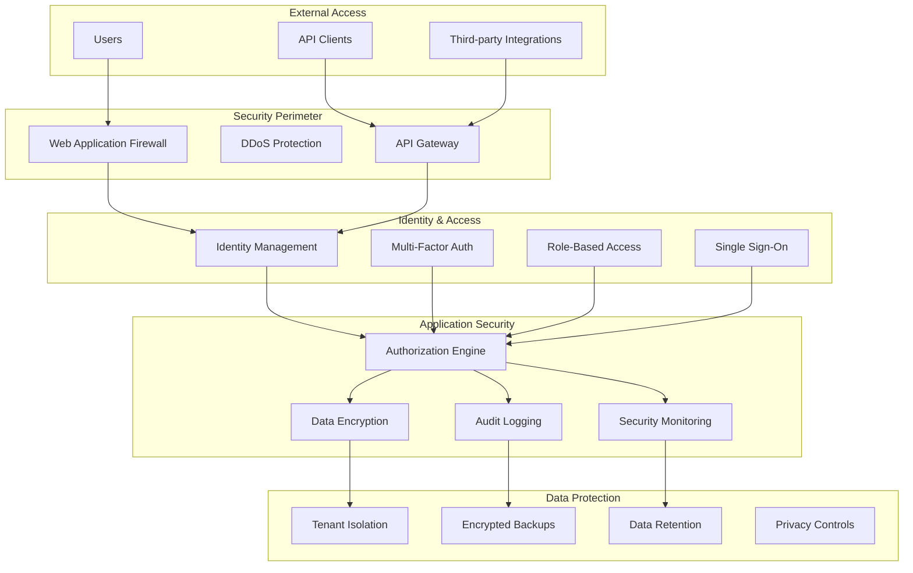

# Enterprise Security & Compliance Requirements

## Executive Summary

Enterprise adoption requires comprehensive security controls, compliance certifications, and governance frameworks. Our platform implements **security by design** with zero-trust architecture, comprehensive audit trails, and support for major compliance standards including SOC 2, ISO 27001, and GDPR.

## Security Architecture Overview

### Zero-Trust Security Model

**Core Principles:**
- Never trust, always verify
- Assume breach and verify explicitly
- Use least privilege access
- Secure all communications end-to-end

**Implementation Framework:**


## Identity & Access Management

### Authentication Framework

#### Multi-Factor Authentication (MFA)
**Requirement**: Mandatory for all enterprise accounts

**Supported Methods:**
- **TOTP (Time-based One-Time Password)**: Google Authenticator, Authy
- **SMS**: Text message verification (backup method)
- **Hardware Tokens**: YubiKey, RSA SecurID
- **Biometric**: WebAuthn/FIDO2 support
- **Push Notifications**: Mobile app approval

**Implementation:**
```typescript
interface MFAConfiguration {
  required: boolean;
  methods: MFAMethod[];
  backupCodes: {
    enabled: boolean;
    count: number;
    singleUse: boolean;
  };
  gracePeriod: {
    newDevices: number; // hours
    trustedDevices: number; // days
  };
}

interface MFAMethod {
  type: 'totp' | 'sms' | 'hardware' | 'biometric' | 'push';
  enabled: boolean;
  priority: number;
  configuration: {
    issuer?: string;
    algorithm?: 'SHA1' | 'SHA256' | 'SHA512';
    digits?: 6 | 8;
    period?: number; // seconds
  };
}
```

#### Single Sign-On (SSO) Integration
**Requirement**: Support for enterprise identity providers

**Supported Protocols:**
- **SAML 2.0**: Industry standard for enterprise SSO
- **OAuth 2.0 / OpenID Connect**: Modern authentication protocol
- **LDAP/Active Directory**: Directory service integration

**Supported Providers:**
- Okta
- Azure Active Directory
- Google Workspace
- Ping Identity
- Auth0
- OneLogin
- Custom SAML/OIDC providers

**Configuration:**
```typescript
interface SSOConfiguration {
  provider: {
    type: 'saml' | 'oidc' | 'ldap';
    name: string;
    issuer: string;
    ssoUrl: string;
    certificate: string;
  };
  
  mapping: {
    userId: string;
    email: string;
    firstName: string;
    lastName: string;
    groups: string[];
    roles: string[];
  };
  
  settings: {
    autoProvisioning: boolean;
    groupMapping: Record<string, string>;
    defaultRole: string;
    sessionDuration: number; // hours
  };
}
```

### Authorization & Access Control

#### Role-Based Access Control (RBAC)
**Framework**: Hierarchical roles with granular permissions

**Standard Roles:**
```typescript
const StandardRoles = {
  // Organization Level
  'org:owner': {
    permissions: ['*'], // All permissions
    description: 'Full organization control'
  },
  'org:admin': {
    permissions: [
      'org:read', 'org:update', 'org:invite',
      'project:create', 'project:read', 'project:update',
      'user:read', 'user:update', 'user:deactivate'
    ],
    description: 'Organization administration'
  },
  'org:member': {
    permissions: ['org:read', 'project:read'],
    description: 'Basic organization access'
  },
  
  // Project Level
  'project:owner': {
    permissions: [
      'project:read', 'project:update', 'project:delete',
      'project:invite', 'project:remove-member',
      'document:create', 'document:read', 'document:update', 'document:delete',
      'task:create', 'task:read', 'task:update', 'task:delete'
    ],
    description: 'Full project control'
  },
  'project:admin': {
    permissions: [
      'project:read', 'project:update', 'project:invite',
      'document:create', 'document:read', 'document:update',
      'task:create', 'task:read', 'task:update'
    ],
    description: 'Project administration'
  },
  'project:member': {
    permissions: [
      'project:read', 'document:read', 'document:update',
      'task:read', 'task:update'
    ],
    description: 'Project team member'
  },
  'project:viewer': {
    permissions: ['project:read', 'document:read', 'task:read'],
    description: 'Read-only project access'
  }
};
```

#### Attribute-Based Access Control (ABAC)
**Advanced**: Context-aware access decisions

**Attributes Considered:**
- User attributes (role, department, clearance level)
- Resource attributes (classification, owner, project)
- Environmental attributes (time, location, device)
- Action attributes (read, write, delete, share)

**Policy Example:**
```typescript
interface AccessPolicy {
  id: string;
  name: string;
  description: string;
  
  conditions: {
    user: {
      roles?: string[];
      departments?: string[];
      clearanceLevel?: number;
    };
    resource: {
      classification?: 'public' | 'internal' | 'confidential' | 'restricted';
      projectIds?: string[];
      owners?: string[];
    };
    environment: {
      timeRange?: { start: string; end: string };
      allowedLocations?: string[];
      trustedDevices?: boolean;
    };
    action: {
      operations: string[];
      riskLevel?: 'low' | 'medium' | 'high';
    };
  };
  
  effect: 'allow' | 'deny';
  priority: number;
}
```

## Data Protection & Privacy

### Encryption Standards

#### Data at Rest
**Requirement**: AES-256 encryption for all stored data

**Implementation:**
- **Database**: Transparent Data Encryption (TDE) with AES-256
- **File Storage**: Server-side encryption with customer-managed keys
- **Backups**: Encrypted with separate key management
- **Logs**: Encrypted with field-level encryption for sensitive data

**Key Management:**
```typescript
interface EncryptionConfiguration {
  dataAtRest: {
    algorithm: 'AES-256-GCM';
    keyManagement: {
      provider: 'aws-kms' | 'google-kms' | 'azure-keyvault' | 'hashicorp-vault';
      customerManagedKeys: boolean;
      keyRotation: {
        enabled: boolean;
        frequency: number; // days
        autoRotate: boolean;
      };
    };
  };
  
  dataInTransit: {
    tls: {
      version: '1.3';
      cipherSuites: string[];
      certificateManagement: 'auto' | 'manual';
    };
    endToEnd: {
      enabled: boolean;
      keyExchange: 'ECDH' | 'RSA';
    };
  };
  
  fieldLevel: {
    enabled: boolean;
    fields: {
      pii: boolean;
      credentials: boolean;
      apiKeys: boolean;
      documents: boolean;
    };
  };
}
```

#### Data in Transit
**Requirement**: TLS 1.3 for all communications

**Implementation:**
- **API Communications**: TLS 1.3 with perfect forward secrecy
- **WebSocket Connections**: WSS with certificate pinning
- **Database Connections**: Encrypted connections with certificate validation
- **Internal Services**: Mutual TLS (mTLS) authentication

### Multi-Tenant Data Isolation

#### Tenant Isolation Strategy
**Approach**: Shared infrastructure with logical data separation

**Implementation Layers:**
1. **Application Layer**: Row-level security policies
2. **Database Layer**: Schema-based tenant isolation
3. **Cache Layer**: Tenant-prefixed keys
4. **File Storage**: Tenant-specific buckets/containers

**Technical Implementation:**
```sql
-- Row-level security policy
CREATE POLICY tenant_isolation ON projects
  FOR ALL TO application_user
  USING (organization_id = current_setting('app.current_organization')::UUID);

-- Tenant-aware indexes
CREATE INDEX CONCURRENTLY idx_projects_tenant_created 
ON projects (organization_id, created_at DESC);

-- Audit trail with tenant context
CREATE TABLE audit_log (
  id UUID PRIMARY KEY,
  organization_id UUID NOT NULL,
  user_id UUID NOT NULL,
  action VARCHAR(50) NOT NULL,
  resource_type VARCHAR(50) NOT NULL,
  resource_id UUID,
  metadata JSONB,
  ip_address INET,
  user_agent TEXT,
  timestamp TIMESTAMP DEFAULT NOW()
);
```

### Data Retention & Deletion

#### Retention Policies
**Framework**: Configurable retention with automatic enforcement

**Categories:**
- **Active Data**: User content and application data
- **Audit Logs**: Security and compliance tracking
- **Backup Data**: Point-in-time recovery
- **Analytics Data**: Aggregated usage metrics

**Configuration:**
```typescript
interface RetentionPolicy {
  category: 'active' | 'audit' | 'backup' | 'analytics';
  retentionPeriod: {
    value: number;
    unit: 'days' | 'months' | 'years';
  };
  
  actions: {
    warning: {
      enabled: boolean;
      notifyBefore: number; // days
      recipients: string[];
    };
    archival: {
      enabled: boolean;
      storageClass: 'standard' | 'ia' | 'glacier' | 'deep-archive';
    };
    deletion: {
      enabled: boolean;
      method: 'soft' | 'hard';
      verification: boolean;
    };
  };
  
  exceptions: {
    legalHold: boolean;
    complianceRequirement?: string;
    customRetention?: {
      value: number;
      unit: 'days' | 'months' | 'years';
      justification: string;
    };
  };
}
```

## Compliance Framework

### SOC 2 Type II Compliance

#### Trust Service Criteria

**Security (CC1-CC8):**
- CC1.1: COSO framework implementation
- CC1.2: Oversight responsibility assignment
- CC1.3: Management authority and responsibility
- CC1.4: Commitment to competence
- CC2.1: Risk assessment process
- CC3.1: Control environment policies
- CC4.1: Information and communication
- CC5.1: Monitoring controls

**Availability (A1.1-A1.3):**
- A1.1: Performance monitoring and management
- A1.2: Capacity monitoring and management
- A1.3: System availability monitoring

**Processing Integrity (PI1.1):**
- PI1.1: System processing authorization

**Confidentiality (C1.1-C1.2):**
- C1.1: Confidential information identification
- C1.2: Confidential information disposal

**Privacy (P1.1-P8.1):**
- P1.1: Privacy notice and consent
- P2.1: Privacy risk assessment
- P3.1: Privacy data collection
- P4.1: Privacy data use and retention
- P5.1: Privacy data access
- P6.1: Privacy data disclosure
- P7.1: Privacy data quality
- P8.1: Privacy data monitoring

#### Implementation Evidence

**Control Activities:**
```typescript
interface SOC2Control {
  id: string;
  category: 'security' | 'availability' | 'processing' | 'confidentiality' | 'privacy';
  criterion: string;
  description: string;
  
  implementation: {
    policies: string[];
    procedures: string[];
    technologies: string[];
    personnel: string[];
  };
  
  testing: {
    frequency: 'continuous' | 'monthly' | 'quarterly' | 'annually';
    method: 'automated' | 'manual' | 'inquiry' | 'observation';
    evidence: string[];
  };
  
  monitoring: {
    metrics: string[];
    thresholds: Record<string, number>;
    alerting: boolean;
    reporting: 'realtime' | 'daily' | 'weekly' | 'monthly';
  };
}
```

### ISO 27001 Information Security Management

#### Security Controls (Annex A)

**A.5 Information Security Policies:**
- A.5.1.1: Information security policy
- A.5.1.2: Review of information security policies

**A.6 Organization of Information Security:**
- A.6.1.1: Information security roles and responsibilities
- A.6.1.2: Segregation of duties
- A.6.1.3: Contact with authorities
- A.6.1.4: Contact with special interest groups
- A.6.1.5: Information security in project management

**A.7 Human Resource Security:**
- A.7.1.1: Screening
- A.7.1.2: Terms and conditions of employment
- A.7.2.1: Management responsibilities
- A.7.2.2: Information security awareness, education and training
- A.7.2.3: Disciplinary process

**A.8 Asset Management:**
- A.8.1.1: Inventory of assets
- A.8.1.2: Ownership of assets
- A.8.1.3: Acceptable use of assets
- A.8.1.4: Return of assets
- A.8.2.1: Classification of information
- A.8.2.2: Labeling of information
- A.8.2.3: Handling of assets

#### Risk Management Framework

```typescript
interface SecurityRisk {
  id: string;
  title: string;
  description: string;
  
  classification: {
    category: 'confidentiality' | 'integrity' | 'availability';
    source: 'internal' | 'external';
    type: 'technical' | 'operational' | 'legal' | 'strategic';
  };
  
  assessment: {
    likelihood: 1 | 2 | 3 | 4 | 5; // Very Low to Very High
    impact: 1 | 2 | 3 | 4 | 5; // Very Low to Very High
    riskScore: number; // likelihood * impact
    inherentRisk: number;
    residualRisk: number;
  };
  
  treatment: {
    strategy: 'accept' | 'avoid' | 'mitigate' | 'transfer';
    controls: SecurityControl[];
    timeline: {
      start: Date;
      target: Date;
      review: Date;
    };
    responsible: string;
  };
  
  monitoring: {
    kpis: string[];
    frequency: 'continuous' | 'monthly' | 'quarterly';
    lastReview: Date;
    nextReview: Date;
  };
}
```

### GDPR Compliance (EU Regulation)

#### Data Protection Principles

**Article 5 - Principles:**
1. **Lawfulness, fairness and transparency**
2. **Purpose limitation**
3. **Data minimisation**
4. **Accuracy**
5. **Storage limitation**
6. **Integrity and confidentiality**
7. **Accountability**

#### Data Subject Rights

**Implementation Framework:**
```typescript
interface GDPRImplementation {
  dataSubjectRights: {
    // Article 15 - Right of access
    access: {
      requestProcess: string;
      responseTime: number; // days
      dataFormat: 'json' | 'xml' | 'pdf';
      verification: 'identity' | 'mfa' | 'signed-request';
    };
    
    // Article 16 - Right to rectification
    rectification: {
      selfService: boolean;
      requestProcess: string;
      responseTime: number; // days
      notificationRequired: boolean;
    };
    
    // Article 17 - Right to erasure ('right to be forgotten')
    erasure: {
      automaticProcessing: boolean;
      manualReview: boolean;
      exceptions: string[];
      confirmationRequired: boolean;
    };
    
    // Article 18 - Right to restriction of processing
    restriction: {
      temporarySuspension: boolean;
      limitedProcessing: boolean;
      notificationRequired: boolean;
    };
    
    // Article 20 - Right to data portability
    portability: {
      formats: string[];
      scope: 'all' | 'user-provided' | 'derived';
      delivery: 'download' | 'transfer' | 'api';
    };
    
    // Article 21 - Right to object
    objection: {
      marketingOptOut: boolean;
      profilingOptOut: boolean;
      legitimateInterestOverride: boolean;
    };
  };
  
  dataProcessing: {
    lawfulBasis: (
      'consent' | 'contract' | 'legal-obligation' | 
      'vital-interests' | 'public-task' | 'legitimate-interests'
    )[];
    
    dataCategories: {
      personal: string[];
      sensitive: string[];
      pseudonymized: string[];
      anonymous: string[];
    };
    
    retentionPolicies: RetentionPolicy[];
    dataFlows: DataFlow[];
  };
  
  governance: {
    dpo: {
      appointed: boolean;
      contact: string;
      responsibilities: string[];
    };
    
    privacyByDesign: {
      dataProtectionImpactAssessment: boolean;
      privacyByDefault: boolean;
      dataMinimization: boolean;
    };
    
    records: {
      processingActivities: string;
      dataBreaches: string;
      consentManagement: string;
    };
  };
}
```

#### Data Breach Response

**72-Hour Notification Requirement:**
```typescript
interface DataBreachResponse {
  detection: {
    monitoringTools: string[];
    alertThresholds: Record<string, number>;
    escalationMatrix: EscalationLevel[];
  };
  
  assessment: {
    impactAnalysis: {
      dataTypes: string[];
      individuals: number;
      jurisdictions: string[];
      riskLevel: 'low' | 'medium' | 'high';
    };
    
    timeline: {
      detected: Date;
      contained: Date;
      assessed: Date;
      notified: Date;
    };
  };
  
  notification: {
    supervisoryAuthority: {
      required: boolean;
      deadline: Date;
      method: 'online-form' | 'email' | 'phone';
      reference: string;
    };
    
    dataSubjects: {
      required: boolean;
      criteria: string;
      method: 'email' | 'website' | 'mail' | 'public-notice';
      message: string;
    };
  };
  
  remediation: {
    technicalMeasures: string[];
    organizationalMeasures: string[];
    preventiveMeasures: string[];
    timeline: Date;
  };
}
```

## Audit & Monitoring

### Comprehensive Audit Logging

#### Audit Event Categories

**Authentication & Authorization:**
- User login/logout events
- Failed authentication attempts
- Password changes and resets
- Role and permission changes
- SSO authentication events

**Data Access & Modification:**
- Document creation, modification, deletion
- Project access and sharing
- File uploads and downloads
- Database queries and modifications
- API access and usage

**Administrative Actions:**
- User account creation/modification/deletion
- Organization settings changes
- Integration configuration changes
- Billing and subscription modifications
- System configuration updates

**Security Events:**
- Suspicious activity detection
- Failed authorization attempts
- Rate limiting violations
- IP address blacklisting
- Security policy violations

#### Audit Log Structure

```typescript
interface AuditEvent {
  // Event Identification
  id: string;
  timestamp: Date;
  eventType: string;
  category: 'auth' | 'data' | 'admin' | 'security' | 'system';
  
  // Actor Information
  actor: {
    type: 'user' | 'service' | 'system';
    id: string;
    name?: string;
    email?: string;
    role?: string;
    impersonatedBy?: string;
  };
  
  // Resource Information
  resource: {
    type: string;
    id?: string;
    name?: string;
    organizationId: string;
    projectId?: string;
  };
  
  // Action Details
  action: {
    operation: string;
    method?: 'GET' | 'POST' | 'PUT' | 'DELETE' | 'PATCH';
    endpoint?: string;
    parameters?: Record<string, any>;
    changes?: {
      before?: any;
      after?: any;
    };
  };
  
  // Context Information
  context: {
    ipAddress: string;
    userAgent?: string;
    sessionId?: string;
    requestId?: string;
    sourceSystem?: string;
    geolocation?: {
      country: string;
      region: string;
      city: string;
    };
  };
  
  // Result Information
  result: {
    status: 'success' | 'failure' | 'error';
    statusCode?: number;
    errorMessage?: string;
    duration?: number; // milliseconds
  };
  
  // Compliance Metadata
  compliance: {
    retentionPeriod: number; // days
    dataClassification: 'public' | 'internal' | 'confidential' | 'restricted';
    jurisdictions: string[];
    tags?: string[];
  };
}
```

### Security Monitoring & SIEM Integration

#### Real-Time Security Monitoring

**Threat Detection Rules:**
```typescript
interface SecurityRule {
  id: string;
  name: string;
  description: string;
  severity: 'low' | 'medium' | 'high' | 'critical';
  
  trigger: {
    eventTypes: string[];
    conditions: {
      field: string;
      operator: 'equals' | 'contains' | 'gt' | 'lt' | 'in' | 'regex';
      value: any;
    }[];
    timeWindow?: {
      duration: number; // minutes
      threshold: number; // occurrences
    };
  };
  
  actions: {
    alert: {
      enabled: boolean;
      channels: ('email' | 'slack' | 'pagerduty' | 'webhook')[];
      recipients: string[];
    };
    block: {
      enabled: boolean;
      duration: number; // minutes
      scope: 'user' | 'ip' | 'organization';
    };
    investigate: {
      enabled: boolean;
      playbook?: string;
      assignee?: string;
    };
  };
}
```

**Example Security Rules:**
1. **Multiple Failed Logins**: >5 failed attempts in 10 minutes
2. **Unusual Access Patterns**: Access from new country/device
3. **Privilege Escalation**: Role changes outside business hours
4. **Data Exfiltration**: Large downloads or API calls
5. **Suspicious API Usage**: Unusual API patterns or rates

#### SIEM Integration

**Supported SIEM Platforms:**
- Splunk
- Elastic Security (ELK Stack)
- IBM QRadar
- Microsoft Sentinel
- Sumo Logic
- LogRhythm

**Integration Methods:**
- **Syslog**: RFC 5424 compliant log forwarding
- **REST API**: Real-time event streaming
- **File Export**: Batch log file delivery
- **Message Queue**: Kafka/RabbitMQ integration

## Business Continuity & Disaster Recovery

### High Availability Architecture

#### Service Level Objectives (SLOs)

**Availability Targets:**
- **Service Availability**: 99.9% uptime (8.77 hours downtime/year)
- **Database Availability**: 99.95% uptime
- **Real-time Features**: 99.5% uptime
- **AI Services**: 99.0% uptime

**Performance Targets:**
- **Page Load Time**: <2 seconds (95th percentile)
- **API Response Time**: <500ms (95th percentile)
- **Real-time Latency**: <100ms (99th percentile)
- **Document Save Time**: <1 second (99th percentile)

#### Disaster Recovery Strategy

**Recovery Objectives:**
- **Recovery Time Objective (RTO)**: 4 hours maximum
- **Recovery Point Objective (RPO)**: 1 hour maximum
- **Mean Time to Recovery (MTTR)**: 2 hours target

**Implementation:**
```typescript
interface DisasterRecoveryPlan {
  dataBackup: {
    strategy: 'continuous' | 'near-realtime' | 'periodic';
    frequency: number; // minutes
    retention: {
      daily: number; // days
      weekly: number; // weeks
      monthly: number; // months
      yearly: number; // years
    };
    geographic: {
      regions: string[];
      crossRegionReplication: boolean;
      replicationLag: number; // seconds
    };
  };
  
  failover: {
    automatic: boolean;
    healthChecks: {
      intervals: number; // seconds
      thresholds: {
        responseTime: number; // ms
        errorRate: number; // percentage
        availability: number; // percentage
      };
    };
    procedures: {
      detection: string;
      decision: string;
      execution: string;
      communication: string;
    };
  };
  
  testing: {
    frequency: 'monthly' | 'quarterly' | 'annually';
    scope: 'component' | 'service' | 'full-system';
    scenarios: string[];
    successCriteria: {
      rto: number; // hours
      rpo: number; // hours
      dataIntegrity: number; // percentage
    };
  };
}
```

---

*Last Updated: January 2025*
*Compliance Review: Quarterly*
*Security Assessment: Monthly*
*Penetration Testing: Bi-annually*