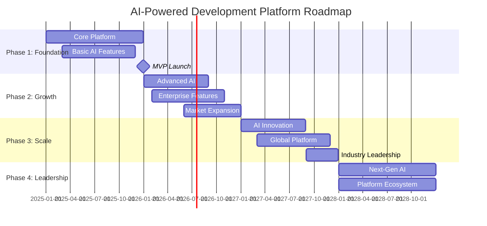

# Development Roadmap & Implementation Guide

## Executive Summary

The development roadmap spans **36 months** across four major phases, from MVP launch to market leadership. Each phase builds systematically on previous capabilities while maintaining focus on customer value delivery and market validation.

## Roadmap Overview



## Phase 1: Foundation (Months 1-12)

### Objectives
- Establish core platform functionality
- Validate product-market fit
- Build initial customer base (50+ organizations)
- Achieve MVP feature completeness

### Key Deliverables

#### Q1 (Months 1-3): Infrastructure & Core Platform

**Infrastructure Setup:**
- Multi-tenant cloud infrastructure on GCP
- CI/CD pipelines and deployment automation
- Monitoring, logging, and observability stack
- Basic security framework and compliance controls

**Core Platform Features:**
- User authentication and organization management
- Project creation and basic task management
- Real-time collaborative document editing
- Basic notification system

**Technical Milestones:**
```typescript
// Q1 Technical Deliverables
interface Q1Deliverables {
  infrastructure: {
    cloudSetup: 'GCP with Kubernetes (GKE)';
    databases: 'PostgreSQL (Cloud SQL) + Redis (Memorystore)';
    monitoring: 'Google Cloud Monitoring + Jaeger tracing';
    cicd: 'GitHub Actions with automated testing';
  };
  
  coreFeatures: {
    authentication: 'OAuth 2.0 + basic MFA';
    multiTenancy: 'Row-level security with tenant isolation';
    collaboration: 'WebSocket-based real-time editing';
    storage: 'Google Cloud Storage with CDN';
  };
  
  qualityMetrics: {
    testCoverage: '>80%';
    apiResponseTime: '<200ms (95th percentile)';
    uptime: '>99%';
    securityScan: 'Automated SAST/DAST in CI/CD';
  };
}
```

#### Q2 (Months 4-6): AI Integration & Basic Features

**AI Assistant Development:**
- Model Context Protocol (MCP) server implementation
- Basic content generation and task breakdown
- Context assembly from project data
- Simple AI suggestions and auto-completion

**Enhanced Collaboration:**
- Advanced document templates
- Comment and discussion system
- Version history and change tracking
- Basic approval workflows

**Integration Framework:**
- GitHub/GitLab integration for repository linking
- Slack/Teams notifications
- REST API for third-party integrations
- Webhook system for external events

#### Q3 (Months 7-9): Enterprise Readiness

**Security & Compliance:**
- Single Sign-On (SSO) with SAML/OIDC
- Role-based access control (RBAC)
- Audit logging and compliance reporting
- Data encryption at rest and in transit

**Advanced Project Management:**
- Gantt charts and timeline visualization
- Resource allocation and capacity planning
- Risk tracking and mitigation planning
- Custom workflows and automation rules

**Performance & Scalability:**
- Database optimization and query performance
- Caching strategy implementation
- Load testing and performance benchmarking
- Auto-scaling configuration

#### Q4 (Months 10-12): MVP Launch & Optimization

**AI Enhancement:**
- Improved content generation accuracy
- Context-aware suggestions
- Basic predictive analytics
- User feedback integration for AI improvement

**User Experience:**
- Mobile-responsive design completion
- Comprehensive onboarding flow
- In-app help and documentation
- User feedback collection system

**Go-to-Market Preparation:**
- Customer success platform setup
- Sales enablement tools and collateral
- Marketing automation and analytics
- Pricing and billing system implementation

### Success Metrics (Phase 1)

**Product Metrics:**
- 50+ organizations using the platform
- 1,000+ active users
- 70% user retention after 30 days
- 4.5+ app store rating (if applicable)

**Technical Metrics:**
- 99%+ uptime achievement
- <2 second page load times
- <100ms real-time collaboration latency
- Zero critical security vulnerabilities

**Business Metrics:**
- $500K+ in Annual Recurring Revenue (ARR)
- <$3K Customer Acquisition Cost (CAC)
- >$25K Customer Lifetime Value (LTV)
- 3+ months average sales cycle

---

## Phase 2: Growth (Months 13-24)

### Objectives
- Scale to enterprise customers
- Achieve competitive differentiation through advanced AI
- Expand market reach and customer base
- Build sustainable growth engine

### Key Deliverables

#### Q5-Q6 (Months 13-18): Advanced AI & Enterprise Features

**Predictive Analytics Engine:**
- Machine learning pipeline for project success prediction
- Risk assessment and early warning systems
- Resource optimization recommendations
- Historical data analysis and benchmarking

**Advanced AI Capabilities:**
- Multi-model AI orchestration
- Specialized models for different content types
- AI-powered code analysis and review
- Technical debt quantification

**Enterprise Security:**
- Advanced threat detection and response
- Compliance reporting (SOC 2, ISO 27001)
- Data loss prevention (DLP)
- Advanced audit and monitoring

#### Q7-Q8 (Months 19-24): Market Expansion & Platform Maturity

**Global Expansion:**
- Multi-language support (5+ languages)
- Regional data centers (EU, APAC)
- Local compliance (GDPR, data residency)
- Currency and payment localization

**Advanced Integrations:**
- Enterprise tool ecosystem (ServiceNow, Jira, etc.)
- CI/CD platform integrations
- Business intelligence and reporting tools
- Custom API and webhook framework

**AI Innovation:**
- Natural language project management
- Advanced code generation and refactoring
- Automated testing and quality assurance
- Intelligent resource allocation

### Success Metrics (Phase 2)

**Growth Metrics:**
- 500+ organizations
- 25,000+ active users
- $5M+ ARR
- 25%+ monthly growth rate

**Market Metrics:**
- 5+ Fortune 500 customers
- 15+ industry verticals represented
- 80%+ Net Promoter Score (NPS)
- 90%+ customer renewal rate

---

## Phase 3: Scale (Months 25-36)

### Objectives
- Achieve market leadership position
- Drive platform standardization
- Build ecosystem and partner network
- Establish sustainable competitive advantages

### Key Deliverables

#### Q9-Q10 (Months 25-30): AI Leadership & Ecosystem

**Next-Generation AI:**
- Custom model training for organizations
- Cross-project learning and insights
- Automated project orchestration
- AI-driven business intelligence

**Platform Ecosystem:**
- Third-party app marketplace
- Developer SDK and APIs
- Partner integration program
- White-label and embedding options

#### Q11-Q12 (Months 31-36): Market Leadership

**Industry Standards:**
- Open-source contributions
- Industry standard proposals
- Thought leadership and research
- Academic and research partnerships

**Advanced Capabilities:**
- Quantum-ready security
- Edge computing support
- IoT and embedded system integration
- Advanced analytics and ML platforms

### Success Metrics (Phase 3)

**Market Leadership:**
- 2,000+ organizations
- 100,000+ active users
- $50M+ ARR
- #1 market position in analyst reports

**Platform Metrics:**
- 100+ ecosystem partners
- 500+ third-party integrations
- 1M+ AI interactions per day
- 95%+ customer satisfaction

---

## Technical Implementation Strategy

### Development Methodology

#### Agile Framework
**Approach**: Scaled Agile Framework (SAFe) with quarterly Program Increments

**Sprint Structure:**
- 2-week sprints
- Quarterly planning sessions
- Monthly retrospectives
- Continuous integration and deployment

**Team Organization:**
```typescript
interface DevelopmentTeam {
  coreTeams: {
    platform: {
      members: 8;
      focus: 'Infrastructure, security, performance';
      technologies: ['TypeScript', 'Node.js', 'PostgreSQL', 'Redis'];
    };
    
    frontend: {
      members: 6;
      focus: 'User interface, user experience, mobile';
      technologies: ['React', 'TypeScript', 'WebSocket', 'PWA'];
    };
    
    ai: {
      members: 10;
      focus: 'AI/ML, data science, model training';
      technologies: ['Python', 'TensorFlow', 'PyTorch', 'MLOps'];
    };
    
    integrations: {
      members: 4;
      focus: 'Third-party integrations, APIs, webhooks';
      technologies: ['REST', 'GraphQL', 'OAuth', 'WebRTC'];
    };
  };
  
  supportTeams: {
    devops: {
      members: 3;
      focus: 'Infrastructure, CI/CD, monitoring';
      technologies: ['Kubernetes', 'Terraform', 'Docker', 'GCP'];
    };
    
    security: {
      members: 2;
      focus: 'Security, compliance, penetration testing';
      technologies: ['SIEM', 'IAM', 'Encryption', 'Compliance'];
    };
    
    qa: {
      members: 4;
      focus: 'Testing, automation, quality assurance';
      technologies: ['Jest', 'Cypress', 'Playwright', 'K6'];
    };
  };
}
```

### Quality Assurance Strategy

#### Testing Pyramid

**Unit Tests (70%):**
- Individual component testing
- Business logic validation
- AI model unit testing
- Database query testing

**Integration Tests (20%):**
- API endpoint testing
- Database integration testing
- Third-party service mocking
- Cross-service communication

**End-to-End Tests (10%):**
- User journey validation
- Critical path testing
- Performance regression testing
- Security vulnerability testing

#### Continuous Quality Monitoring

```typescript
interface QualityMetrics {
  codeQuality: {
    testCoverage: {
      target: 85;
      current: number;
      trend: 'improving' | 'stable' | 'declining';
    };
    
    codeComplexity: {
      cyclomaticComplexity: number;
      maintainabilityIndex: number;
      technicalDebt: {
        hours: number;
        trend: 'improving' | 'stable' | 'declining';
      };
    };
  };
  
  performance: {
    responseTime: {
      p50: number; // milliseconds
      p95: number;
      p99: number;
    };
    
    throughput: {
      requestsPerSecond: number;
      concurrentUsers: number;
    };
    
    reliability: {
      uptime: number; // percentage
      errorRate: number; // percentage
      mttr: number; // minutes
    };
  };
  
  security: {
    vulnerabilities: {
      critical: number;
      high: number;
      medium: number;
      low: number;
    };
    
    compliance: {
      soc2: boolean;
      iso27001: boolean;
      gdpr: boolean;
      hipaa: boolean;
    };
  };
}
```

### Technology Stack Evolution

#### Phase 1 Technology Stack
```yaml
Frontend:
  - React 18+ with TypeScript
  - Redux Toolkit for state management
  - WebSocket for real-time features
  - Progressive Web App (PWA)

Backend:
  - Node.js 20+ with TypeScript
  - Express.js with custom middleware
  - PostgreSQL 15+ for primary database
  - Redis 7+ for caching and sessions

AI/ML:
  - Python 3.11+ for AI services
  - OpenAI API for language models
  - Pinecone for vector database
  - TensorFlow for custom models

Infrastructure:
  - Google Cloud Platform (GCP)
  - Kubernetes (GKE) for orchestration
  - Docker for containerization
  - Terraform for infrastructure as code

Monitoring:
  - Google Cloud Monitoring
  - Jaeger for distributed tracing
  - Grafana for visualization
  - AlertManager for notifications
```

#### Phase 2-3 Technology Evolution
```yaml
AI/ML Enhancements:
  - Custom model training with Vertex AI
  - MLOps pipeline with Kubeflow
  - Feature store with Feast
  - Model serving with TFX

Scalability Improvements:
  - Event-driven architecture with Pub/Sub
  - Microservices with gRPC
  - Database sharding and read replicas
  - CDN with global edge locations

Security Additions:
  - Zero-trust network architecture
  - Istio service mesh for security
  - Falco for runtime security monitoring
  - Vault for secrets management
```

## Risk Management & Mitigation

### Technical Risks

#### High-Risk Items

**Real-time Collaboration Scalability:**
- **Risk**: WebSocket connections don't scale to 1000+ concurrent users
- **Probability**: Medium
- **Impact**: High
- **Mitigation**: 
  - Early load testing with simulated users
  - Horizontal scaling architecture design
  - Alternative technologies (WebRTC, Socket.io clusters)
  - Graceful degradation strategies

**AI Model Costs:**
- **Risk**: AI inference costs exceed revenue per user
- **Probability**: Medium
- **Impact**: High
- **Mitigation**:
  - Usage-based pricing model
  - Model optimization and caching
  - Cost monitoring and alerting
  - Efficient prompt engineering

**Data Security & Compliance:**
- **Risk**: Security breach or compliance violation
- **Probability**: Low
- **Impact**: Critical
- **Mitigation**:
  - Security-by-design principles
  - Regular penetration testing
  - Compliance audits and certifications
  - Incident response procedures

#### Medium-Risk Items

**Third-party Integration Reliability:**
- **Risk**: External APIs cause service disruptions
- **Mitigation**: Circuit breakers, fallback mechanisms, SLA monitoring

**Team Scaling Challenges:**
- **Risk**: Difficulty hiring and retaining technical talent
- **Mitigation**: Competitive compensation, remote work options, strong culture

**Technology Vendor Lock-in:**
- **Risk**: Over-dependence on specific cloud provider or AI model
- **Mitigation**: Multi-cloud strategy, open standards, vendor diversity

### Business Risks

#### Market Risks

**Competitive Response:**
- **Risk**: Major incumbents launch competing solutions
- **Probability**: High
- **Impact**: Medium
- **Mitigation**:
  - Fast execution and market leadership
  - Strong IP and trade secrets
  - Customer lock-in through value delivery
  - Continuous innovation

**Economic Downturn:**
- **Risk**: Reduced enterprise software spending
- **Probability**: Medium
- **Impact**: High
- **Mitigation**:
  - ROI-focused value proposition
  - Flexible pricing models
  - Essential workflow positioning
  - Customer success focus

#### Execution Risks

**Product-Market Fit:**
- **Risk**: Solution doesn't address real market needs
- **Probability**: Medium
- **Impact**: Critical
- **Mitigation**:
  - Continuous customer feedback
  - Agile development methodology
  - Early beta testing program
  - Pivot capability maintenance

**Funding Requirements:**
- **Risk**: Unable to raise sufficient capital
- **Probability**: Low
- **Impact**: High
- **Mitigation**:
  - Conservative cash management
  - Revenue milestone achievement
  - Multiple funding sources
  - Operational efficiency focus

## Success Measurements

### Key Performance Indicators (KPIs)

#### Product Development KPIs

**Velocity Metrics:**
- Story points delivered per sprint
- Feature delivery predictability
- Bug fix cycle time
- Code review turnaround time

**Quality Metrics:**
- Test coverage percentage
- Bug escape rate to production
- Performance regression incidents
- Security vulnerability count

**Innovation Metrics:**
- AI model accuracy improvements
- New feature adoption rates
- Customer-requested features delivered
- Technical debt reduction

#### Business Development KPIs

**Growth Metrics:**
- Monthly Recurring Revenue (MRR) growth
- Customer acquisition rate
- User engagement and retention
- Market share indicators

**Efficiency Metrics:**
- Customer Acquisition Cost (CAC)
- Customer Lifetime Value (LTV)
- Sales cycle length
- Implementation success rate

**Satisfaction Metrics:**
- Net Promoter Score (NPS)
- Customer satisfaction (CSAT)
- Support ticket resolution time
- Feature request fulfillment rate

### Milestone Tracking

#### Phase Gate Reviews

**Monthly Reviews:**
- Sprint retrospectives and planning
- Technical debt assessment
- Security and compliance status
- Customer feedback analysis

**Quarterly Reviews:**
- OKR achievement assessment
- Market position analysis
- Competitive intelligence review
- Financial performance evaluation

**Annual Reviews:**
- Strategic plan updates
- Technology roadmap revision
- Team performance and growth
- Market expansion opportunities

---

*Last Updated: January 2025*
*Next Review: Monthly*
*Roadmap Version: 1.0*