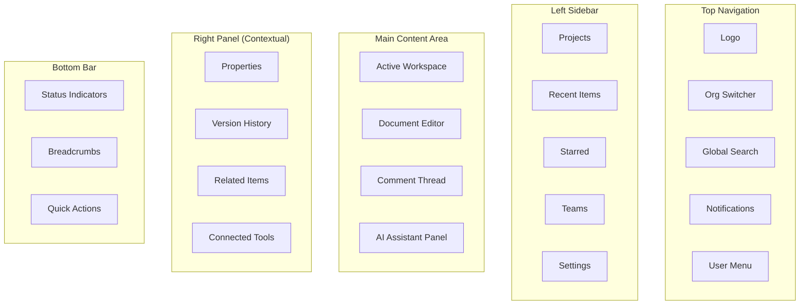
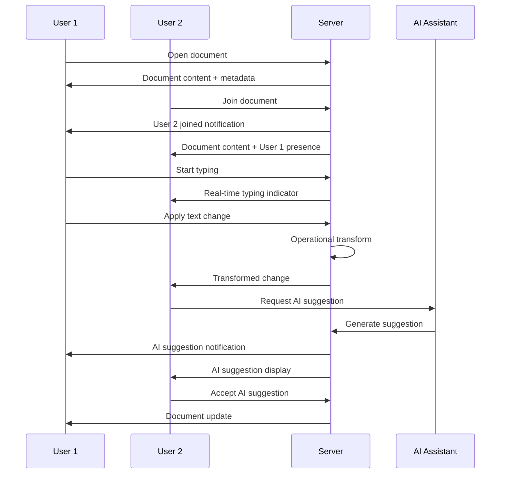
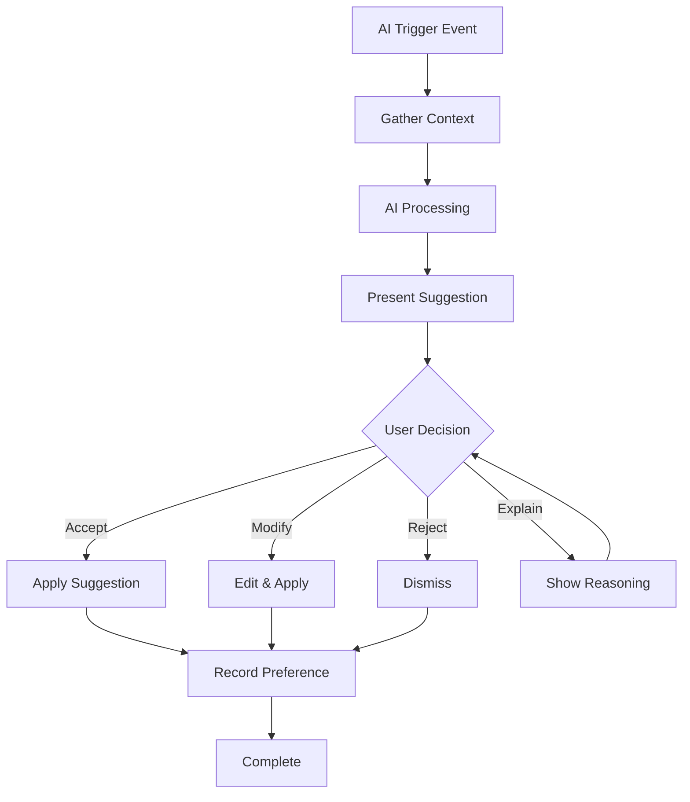

# UX Design Principles & User Experience

## Executive Summary

Our user experience is built on **developer-first design principles** that prioritize efficiency, clarity, and seamless AI integration. The platform combines the familiar feel of modern development tools with innovative collaboration features and contextual AI assistance.

## Core Design Principles

### 1. Developer-Centric Design

**Principle**: Every interface decision prioritizes developer productivity and mental models.

**Implementation:**
- Keyboard-first navigation with comprehensive shortcuts
- Command palette for rapid action execution
- Familiar patterns from popular developer tools (VS Code, GitHub)
- Minimal context switching between related tasks

**Example Applications:**
- Cmd/Ctrl+K opens universal command palette
- Vim keybindings support in text editors
- Git-like version control metaphors for document history
- Dark mode as default with high contrast options

### 2. AI Transparency & Control

**Principle**: AI assistance is powerful but never mysterious or overwhelming.

**Implementation:**
- Clear indicators when AI is processing or suggesting
- One-click acceptance, modification, or rejection of AI suggestions
- Confidence scores and reasoning displayed for AI recommendations
- Easy toggle between AI-assisted and manual modes

**Example Applications:**
- AI suggestions appear with confidence percentages
- "Why did AI suggest this?" expandable explanations
- Undo/redo specifically for AI actions
- AI activity log showing all automated actions

### 3. Contextual Information Architecture

**Principle**: The right information appears at the right time without overwhelming users.

**Implementation:**
- Progressive disclosure of complexity
- Context-sensitive sidebars and panels
- Smart defaults that adapt to user behavior
- Information hierarchy that matches task priority

**Example Applications:**
- Project dashboard shows most relevant metrics for current sprint
- Side panels auto-populate with related documents during editing
- Recent files and smart suggestions in navigation
- Role-based interface customization (PM vs Developer vs Architect)

### 4. Real-Time Collaboration Clarity

**Principle**: Multiplayer editing feels natural and conflict-free.

**Implementation:**
- Clear presence indicators for all active users
- Conflict-free operational transform with visual feedback
- Comments and discussions anchored to specific content
- Activity streams that provide context without noise

**Example Applications:**
- Live cursors with user avatars and names
- Real-time typing indicators
- Inline comments with threaded discussions
- "Follow" mode to shadow another user's navigation

## User Interface Architecture

### Primary Navigation Structure



### Page Layout Patterns

#### Project Dashboard Layout
```typescript
interface ProjectDashboardLayout {
  header: {
    projectName: string;
    statusIndicator: ProjectStatus;
    actionMenu: QuickAction[];
    collaboratorAvatars: UserAvatar[];
  };
  
  mainContent: {
    keyMetrics: MetricCard[];
    progressChart: ProjectProgress;
    upcomingMilestones: Milestone[];
    riskAlerts: RiskAlert[];
  };
  
  sidebar: {
    recentDocuments: Document[];
    teamActivity: ActivityItem[];
    integrationStatus: IntegrationStatus[];
  };
}
```

#### Document Editor Layout
```typescript
interface DocumentEditorLayout {
  toolbar: {
    documentActions: DocumentAction[];
    formattingControls: FormattingTool[];
    collaborationTools: CollabTool[];
    aiAssistant: AIToggle;
  };
  
  editor: {
    primaryContent: DocumentContent;
    liveCollaboration: CollaborationLayer;
    aiSuggestions: AISuggestionOverlay;
    comments: CommentLayer;
  };
  
  contextPanel: {
    outline: DocumentOutline;
    relatedContent: RelatedItem[];
    versionHistory: VersionHistory;
    aiInsights: AIInsight[];
  };
}
```

## Component Design System

### Color Palette

#### Primary Colors
- **Primary Blue**: #2563eb (action items, links, primary buttons)
- **Success Green**: #059669 (completed tasks, success states)
- **Warning Orange**: #d97706 (caution states, pending reviews)
- **Error Red**: #dc2626 (errors, critical alerts, destructive actions)

#### Neutral Colors
- **Gray 900**: #111827 (primary text on light backgrounds)
- **Gray 700**: #374151 (secondary text)
- **Gray 500**: #6b7280 (tertiary text, placeholders)
- **Gray 300**: #d1d5db (borders, dividers)
- **Gray 100**: #f3f4f6 (subtle backgrounds)
- **Gray 50**: #f9fafb (page backgrounds)

#### Dark Mode Palette
- **Dark Primary**: #1e293b (main background)
- **Dark Secondary**: #334155 (card backgrounds)
- **Dark Text**: #f1f5f9 (primary text)
- **Dark Text Secondary**: #cbd5e1 (secondary text)

### Typography Scale

```css
/* Heading Styles */
.heading-xl { font-size: 2.25rem; font-weight: 700; line-height: 1.2; }
.heading-lg { font-size: 1.875rem; font-weight: 600; line-height: 1.3; }
.heading-md { font-size: 1.5rem; font-weight: 600; line-height: 1.4; }
.heading-sm { font-size: 1.25rem; font-weight: 600; line-height: 1.4; }
.heading-xs { font-size: 1.125rem; font-weight: 600; line-height: 1.4; }

/* Body Text */
.body-lg { font-size: 1.125rem; font-weight: 400; line-height: 1.6; }
.body-md { font-size: 1rem; font-weight: 400; line-height: 1.6; }
.body-sm { font-size: 0.875rem; font-weight: 400; line-height: 1.5; }
.body-xs { font-size: 0.75rem; font-weight: 400; line-height: 1.4; }

/* Code Text */
.code-md { font-family: 'JetBrains Mono', monospace; font-size: 0.875rem; }
.code-sm { font-family: 'JetBrains Mono', monospace; font-size: 0.75rem; }
```

### Spacing System

```css
/* Base unit: 4px */
.space-1 { margin: 4px; }   /* 4px */
.space-2 { margin: 8px; }   /* 8px */
.space-3 { margin: 12px; }  /* 12px */
.space-4 { margin: 16px; }  /* 16px */
.space-6 { margin: 24px; }  /* 24px */
.space-8 { margin: 32px; }  /* 32px */
.space-12 { margin: 48px; } /* 48px */
.space-16 { margin: 64px; } /* 64px */
```

## Key User Flows

### New Project Creation Flow

```mermaid
flowchart TD
    Start([User clicks "New Project"]) --> Template[Select Template]
    Template --> Basic[Basic Info Entry]
    Basic --> Team[Add Team Members]
    Team --> Integration[Connect Integrations]
    Integration --> AI[Configure AI Settings]
    AI --> Review[Review & Create]
    Review --> Success[Project Created]
    
    Template -.-> Custom["Custom Template (Advanced)"]
    Custom --> Basic
    
    Basic -.-> Skip1["Skip (defaults)"]
    Skip1 --> Team
    
    Team -.-> Skip2["Skip (add later)"]
    Skip2 --> Integration
    
    Integration -.-> Skip3["Skip (add later)"]
    Skip3 --> AI
```

### Document Collaboration Flow



### AI Assistant Interaction Flow



## Responsive Design Strategy

### Breakpoints

```css
/* Mobile First Approach */
/* Base: Mobile (320px+) */

@media (min-width: 640px) {
  /* Small tablets and large phones */
}

@media (min-width: 768px) {
  /* Tablets */
}

@media (min-width: 1024px) {
  /* Small desktops */
}

@media (min-width: 1280px) {
  /* Large desktops */
}

@media (min-width: 1536px) {
  /* Extra large screens */
}
```

### Mobile Adaptations

#### Navigation Adaptations
- **Desktop**: Fixed left sidebar with project navigation
- **Tablet**: Collapsible sidebar with overlay
- **Mobile**: Bottom tab bar with slide-out navigation

#### Editor Adaptations
- **Desktop**: Multi-panel layout with context sidebar
- **Tablet**: Single panel with swipeable context sheets
- **Mobile**: Full-screen editor with floating action button for context

#### Collaboration Adaptations
- **Desktop**: Live cursors and inline comments
- **Tablet**: Simplified presence indicators
- **Mobile**: Comment threads in modal overlays

## Accessibility Standards

### WCAG 2.1 AA Compliance

#### Color & Contrast
- Minimum contrast ratio: 4.5:1 for normal text
- Minimum contrast ratio: 3:1 for large text
- Color not used as sole indicator of information

#### Keyboard Navigation
- All interactive elements accessible via keyboard
- Logical tab order throughout interface
- Visible focus indicators
- Keyboard shortcuts documented and customizable

#### Screen Reader Support
- Semantic HTML structure with proper headings
- ARIA labels and descriptions for complex interactions
- Alt text for all meaningful images
- Live regions for dynamic content updates

#### Cognitive Accessibility
- Clear, consistent navigation patterns
- Breadcrumbs and location indicators
- Undo/redo functionality for all actions
- Error messages with clear resolution steps

### Assistive Technology Testing

#### Screen Readers
- NVDA (Windows)
- JAWS (Windows)
- VoiceOver (macOS/iOS)
- TalkBack (Android)

#### Other Assistive Tools
- Voice control software
- Switch navigation devices
- Eye tracking systems
- High contrast and zoom tools

## Performance & Loading States

### Loading State Patterns

#### Initial Page Load
```tsx
interface PageLoadingState {
  skeleton: {
    showNavigation: boolean;
    showMainContent: boolean;
    showSidebar: boolean;
    estimatedLoadTime: number;
  };
  
  progressive: {
    criticalContent: number; // 0-100%
    secondaryContent: number; // 0-100%
    enhancementContent: number; // 0-100%
  };
}
```

#### Document Loading
- Skeleton layout appears immediately
- Content streams in progressively
- Interactive elements enabled as they load
- AI features activated last

#### AI Processing States
- Subtle spinner for quick operations (<2s)
- Progress indicator for longer operations (2-10s)
- Cancel option for extended operations (>10s)
- Background processing with notification when complete

### Error State Handling

#### Error Message Hierarchy
1. **Inline Validation**: Real-time form validation
2. **Toast Notifications**: Non-blocking temporary messages
3. **Modal Errors**: Blocking errors requiring user action
4. **Page-Level Errors**: Complete failure states with recovery options

#### Error Recovery Patterns
- "Try Again" buttons with exponential backoff
- "Report Issue" links with context capture
- Graceful degradation to manual workflows
- Offline mode for core functionality

## User Onboarding & Education

### Progressive Onboarding Strategy

#### First Session (Time to Value: <5 minutes)
1. Account setup and team invitation
2. Quick project creation with template
3. Guided tour of main interface areas
4. First document creation with AI assistance

#### Skill Building (Sessions 2-5)
1. Advanced AI features demonstration
2. Collaboration features with team members
3. Integration setup walkthrough
4. Customization and preferences

#### Mastery (Ongoing)
1. Power user shortcuts and tips
2. Advanced workflow automation
3. API and integration development
4. Admin and governance features

### Interactive Tutorial System

```typescript
interface TutorialStep {
  id: string;
  title: string;
  description: string;
  targetElement: string;
  position: 'top' | 'bottom' | 'left' | 'right';
  action?: {
    type: 'click' | 'type' | 'hover';
    value?: string;
  };
  validation?: {
    condition: string;
    message: string;
  };
}

interface TutorialFlow {
  id: string;
  name: string;
  description: string;
  steps: TutorialStep[];
  prerequisites?: string[];
  estimatedDuration: number;
}
```

## User Testing & Feedback Integration

### Continuous User Research

#### Research Methods
- **Moderated usability tests**: Monthly with 8-12 participants
- **Unmoderated testing**: Continuous with larger sample sizes
- **Card sorting**: Information architecture validation
- **A/B testing**: Feature and design variations

#### Feedback Collection
- In-app feedback widgets
- Post-task micro-surveys
- Feature request voting system
- Customer advisory board sessions

#### Analytics & Heat Mapping
- User journey analysis
- Feature adoption tracking
- Error rate monitoring
- Performance impact on user behavior

### Design System Evolution

#### Component Versioning
- Semantic versioning for design system
- Backward compatibility maintenance
- Migration guides for breaking changes
- Component deprecation lifecycle

#### Documentation & Governance
- Living style guide with code examples
- Design token management
- Component API documentation
- Usage guidelines and best practices

---

*Last Updated: January 2025*
*Design System Version: 1.0*
*Next UX Review: Quarterly*
*Accessibility Audit: Annually*