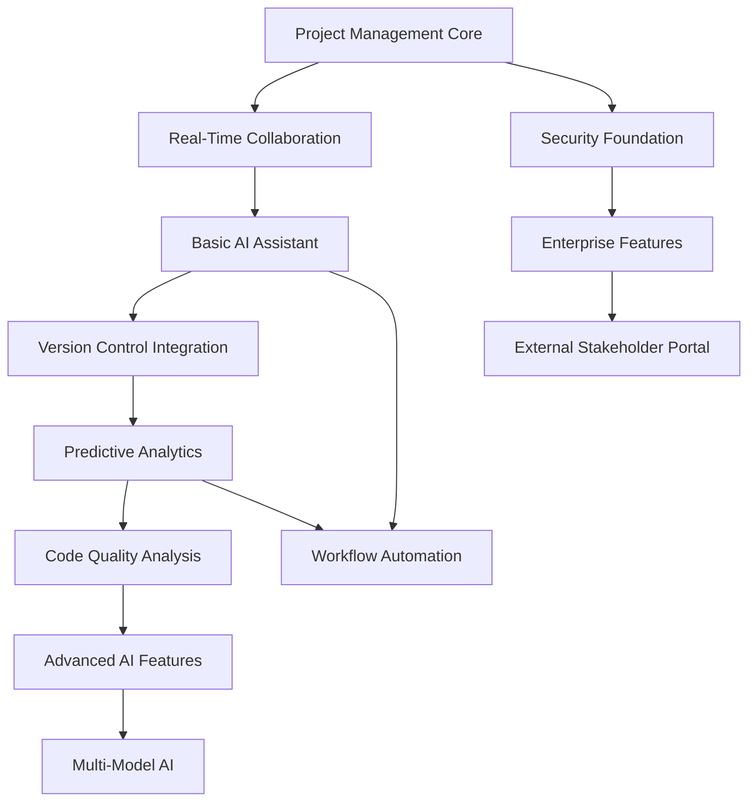

# Product Feature Specifications

## Executive Summary

This document defines the core features and capabilities of the AI-powered software development orchestration platform. Features are organized by priority tiers to support phased development and market validation.

## Feature Hierarchy

### Tier 1: Core Platform (MVP)
**Timeline**: Months 1-12
**Goal**: Establish basic platform functionality and early customer validation

### Tier 2: Advanced Capabilities
**Timeline**: Months 12-24
**Goal**: Competitive differentiation and enterprise readiness

### Tier 3: Innovation Features
**Timeline**: Months 24-36
**Goal**: Market leadership and advanced AI capabilities

---

## Tier 1: Core Platform Features

### 1. Project Management Core

#### Project Creation & Setup
**Priority**: P0 (Blocking MVP)

**Functional Requirements:**
- Create new projects from templates or blank canvas
- Configure project metadata (name, description, goals, timeline)
- Add team members with role-based permissions
- Set up project structure (phases, milestones, deliverables)
- Define success criteria and key metrics

**User Stories:**
```
As a project manager,
I want to create a new project with predefined structure
So that my team has clear direction and organization.

As a team lead,
I want to invite team members with specific roles
So that access and responsibilities are properly managed.
```

**Acceptance Criteria:**
- [ ] Project creation wizard completes in <3 minutes
- [ ] All team members receive invitation emails within 2 minutes
- [ ] Project templates include common software development patterns
- [ ] Role-based permissions prevent unauthorized access
- [ ] Project dashboard displays key information immediately

**Technical Specifications:**
```typescript
interface Project {
  id: string;
  name: string;
  description: string;
  organizationId: string;
  ownerId: string;
  
  metadata: {
    industry: string;
    projectType: 'web' | 'mobile' | 'api' | 'data' | 'infrastructure';
    methodology: 'agile' | 'waterfall' | 'hybrid';
    estimatedDuration: number; // months
    budgetRange: 'small' | 'medium' | 'large' | 'enterprise';
  };
  
  team: TeamMember[];
  phases: ProjectPhase[];
  milestones: Milestone[];
  
  status: 'planning' | 'active' | 'on-hold' | 'completed' | 'cancelled';
  createdAt: Date;
  updatedAt: Date;
}

interface TeamMember {
  userId: string;
  role: 'owner' | 'admin' | 'developer' | 'designer' | 'pm' | 'stakeholder';
  permissions: Permission[];
  joinedAt: Date;
}
```

#### Task & Workflow Management
**Priority**: P0 (Blocking MVP)

**Functional Requirements:**
- Create, assign, and track tasks across team members
- Organize tasks into sprints, phases, or custom workflows
- Set dependencies between tasks and critical path analysis
- Time tracking and effort estimation
- Status updates and progress reporting

**User Stories:**
```
As a developer,
I want to see my assigned tasks with clear priorities
So that I can focus on the most important work.

As a project manager,
I want to track progress across all team members
So that I can identify blockers and resource needs.
```

**Technical Specifications:**
```typescript
interface Task {
  id: string;
  title: string;
  description: string;
  projectId: string;
  
  assignment: {
    assigneeId: string;
    assignedBy: string;
    assignedAt: Date;
  };
  
  metadata: {
    priority: 'low' | 'medium' | 'high' | 'critical';
    complexity: 1 | 2 | 3 | 5 | 8 | 13; // Fibonacci
    category: 'feature' | 'bug' | 'tech-debt' | 'documentation';
    labels: string[];
  };
  
  timeline: {
    estimatedHours: number;
    actualHours?: number;
    startDate?: Date;
    dueDate?: Date;
    completedDate?: Date;
  };
  
  dependencies: {
    blockedBy: string[]; // Task IDs
    blocks: string[]; // Task IDs
  };
  
  status: 'todo' | 'in-progress' | 'review' | 'done' | 'cancelled';
}
```

### 2. Real-Time Collaborative Editing

#### Document Creation & Management
**Priority**: P0 (Core Differentiator)

**Functional Requirements:**
- Create and edit design documents, requirements, and specifications
- Real-time collaborative editing with conflict resolution
- Version history and change tracking
- Rich text formatting with code syntax highlighting
- Document templates for common software artifacts

**User Stories:**
```
As a product manager,
I want to collaborate on requirements documents in real-time
So that stakeholders can provide immediate feedback.

As a software architect,
I want to create design documents with team input
So that decisions are made collaboratively.
```

**Technical Implementation:**
```typescript
// Operational Transform for conflict-free editing
interface Operation {
  type: 'insert' | 'delete' | 'retain';
  position: number;
  content?: string;
  length?: number;
  attributes?: {
    bold?: boolean;
    italic?: boolean;
    code?: boolean;
    link?: string;
  };
}

interface DocumentState {
  id: string;
  content: string;
  version: number;
  operations: Operation[];
  
  collaboration: {
    activeUsers: ActiveUser[];
    cursors: CursorPosition[];
    selections: Selection[];
  };
  
  metadata: {
    title: string;
    type: 'requirements' | 'design' | 'architecture' | 'meeting-notes';
    projectId: string;
    createdBy: string;
    lastModifiedBy: string;
    createdAt: Date;
    modifiedAt: Date;
  };
}

interface ActiveUser {
  userId: string;
  name: string;
  avatar: string;
  cursorPosition: number;
  selection?: {
    start: number;
    end: number;
  };
  lastActivity: Date;
}
```

#### Comment & Discussion System
**Priority**: P1 (Important for collaboration)

**Functional Requirements:**
- Inline comments anchored to specific document sections
- Threaded discussions with mentions and notifications
- Comment resolution and approval workflows
- Activity feeds showing all discussions and changes

### 3. Basic AI Assistant

#### Content Generation
**Priority**: P0 (Core Value Proposition)

**Functional Requirements:**
- Generate project documentation from natural language descriptions
- Create task breakdowns from high-level requirements
- Suggest improvements to existing documents
- Auto-complete and smart suggestions during writing

**User Stories:**
```
As a project manager,
I want AI to help break down epic requirements into user stories
So that planning is faster and more comprehensive.

As a technical writer,
I want AI assistance in documenting APIs and processes
So that documentation stays current and complete.
```

**Technical Specifications:**
```typescript
interface AIAssistant {
  // Content generation capabilities
  generateDocumentation(prompt: string, context: ProjectContext): Promise<GeneratedContent>;
  breakdownRequirements(requirement: string): Promise<TaskBreakdown>;
  suggestImprovements(content: string, type: DocumentType): Promise<Suggestion[]>;
  
  // Smart completions
  getCompletions(text: string, cursorPosition: number): Promise<Completion[]>;
  
  // Context awareness
  assembleContext(projectId: string, documentId?: string): Promise<ProjectContext>;
}

interface GeneratedContent {
  content: string;
  confidence: number; // 0-100
  sources: string[]; // References used
  suggestions: ContentSuggestion[];
}

interface TaskBreakdown {
  tasks: {
    title: string;
    description: string;
    estimatedComplexity: number;
    dependencies: string[];
    acceptance_criteria: string[];
  }[];
  confidence: number;
  reasoning: string;
}
```

### 4. Integrations Foundation

#### Version Control Integration
**Priority**: P0 (Essential for developers)

**Functional Requirements:**
- Connect to GitHub, GitLab, and Bitbucket repositories
- Display commit history and branch information
- Link code changes to project tasks and documents
- Trigger workflows based on repository events

**Technical Specifications:**
```typescript
interface GitIntegration {
  provider: 'github' | 'gitlab' | 'bitbucket';
  repository: {
    owner: string;
    name: string;
    url: string;
    defaultBranch: string;
  };
  
  webhooks: {
    commits: boolean;
    pullRequests: boolean;
    releases: boolean;
    issues: boolean;
  };
  
  authentication: {
    type: 'oauth' | 'token' | 'app';
    credentials: EncryptedCredentials;
  };
}

interface CommitLink {
  commitSha: string;
  message: string;
  author: string;
  timestamp: Date;
  linkedTasks: string[]; // Task IDs
  linkedDocuments: string[]; // Document IDs
}
```

#### Communication Platform Integration
**Priority**: P1 (Important for notifications)

**Functional Requirements:**
- Send notifications to Slack, Microsoft Teams, or Discord
- Create channels for project-specific discussions
- Share updates and milestones automatically
- Bot commands for quick status checks

---

## Tier 2: Advanced Capabilities

### 5. Advanced AI Features

#### Predictive Project Analytics
**Priority**: P0 (Key differentiator)

**Functional Requirements:**
- Predict project completion dates with confidence intervals
- Identify risks and bottlenecks before they become critical
- Recommend resource allocation and timeline adjustments
- Generate executive summaries and status reports

**User Stories:**
```
As an engineering manager,
I want to see early warning signals for project delays
So that I can take corrective action proactively.

As an executive,
I want AI-generated project health summaries
So that I can make informed decisions quickly.
```

**Technical Implementation:**
```typescript
interface PredictiveAnalytics {
  // Project health scoring
  calculateHealthScore(projectId: string): Promise<HealthScore>;
  
  // Timeline prediction
  predictCompletion(projectId: string): Promise<CompletionForecast>;
  
  // Risk assessment
  assessRisks(projectId: string): Promise<RiskAssessment>;
  
  // Resource optimization
  optimizeResources(projectId: string, constraints: ResourceConstraints): Promise<ResourcePlan>;
}

interface HealthScore {
  overall: number; // 0-100
  factors: {
    timeline: number;
    budget: number;
    quality: number;
    teamMorale: number;
    stakeholderSatisfaction: number;
  };
  trend: 'improving' | 'stable' | 'declining';
  alerts: Alert[];
}

interface CompletionForecast {
  expectedDate: Date;
  confidence: number; // 0-100
  scenarios: {
    optimistic: { date: Date; probability: number };
    realistic: { date: Date; probability: number };
    pessimistic: { date: Date; probability: number };
  };
  keyFactors: ForecastFactor[];
}
```

#### Code Quality Analysis
**Priority**: P1 (Technical debt focus)

**Functional Requirements:**
- Analyze code repositories for quality metrics
- Track technical debt accumulation over time
- Suggest refactoring priorities based on business impact
- Integration with static analysis tools and CI/CD pipelines

#### Architecture Conformance Checking
**Priority**: P1 (BDUF methodology)

**Functional Requirements:**
- Compare actual code structure against design documents
- Detect architectural drift and violations
- Suggest corrections to maintain design integrity
- Generate conformance reports for stakeholders

### 6. Enterprise Features

#### Advanced Security & Compliance
**Priority**: P0 (Enterprise requirement)

**Functional Requirements:**
- Single Sign-On (SSO) with SAML and OAuth providers
- Role-based access control with custom permission sets
- Audit logging for all user actions and data changes
- Data encryption at rest and in transit
- Compliance reporting for SOC 2, ISO 27001, GDPR

**Technical Specifications:**
```typescript
interface SecurityConfiguration {
  authentication: {
    sso: {
      enabled: boolean;
      provider: 'okta' | 'azure-ad' | 'google' | 'custom';
      configuration: SSOConfig;
    };
    mfa: {
      required: boolean;
      methods: ('totp' | 'sms' | 'email')[];
    };
  };
  
  authorization: {
    roles: Role[];
    permissions: Permission[];
    policies: AccessPolicy[];
  };
  
  compliance: {
    dataRetention: {
      period: number; // days
      autoDelete: boolean;
    };
    auditLogging: {
      enabled: boolean;
      retentionPeriod: number; // days
      exportFormat: 'json' | 'csv' | 'pdf';
    };
  };
}
```

#### Multi-Tenant Administration
**Priority**: P0 (SaaS requirement)

**Functional Requirements:**
- Organization management with billing and usage tracking
- Tenant isolation and data privacy controls
- Usage analytics and optimization recommendations
- White-label customization options

### 7. Workflow Automation

#### Custom Automation Rules
**Priority**: P1 (Productivity enhancement)

**Functional Requirements:**
- Create if-then rules for common project workflows
- Trigger actions based on project events and milestones
- Integration with external tools and APIs
- Template automation for repetitive processes

**User Stories:**
```
As a project manager,
I want to automatically create tasks when requirements are approved
So that development can start immediately.

As a team lead,
I want notifications sent when code review is needed
So that nothing falls through the cracks.
```

---

## Tier 3: Innovation Features

### 8. Advanced AI Orchestration

#### Multi-Model AI Pipeline
**Priority**: P2 (Advanced differentiation)

**Functional Requirements:**
- Route requests to specialized AI models based on task type
- Ensemble predictions for improved accuracy
- Custom model fine-tuning for organization-specific patterns
- Cost optimization across different model providers

#### Natural Language Project Management
**Priority**: P2 (Future innovation)

**Functional Requirements:**
- Voice commands for task creation and updates
- Natural language queries for project status
- Conversational AI for project planning assistance
- Meeting transcription and action item extraction

### 9. Advanced Analytics & Intelligence

#### Cross-Project Learning
**Priority**: P2 (Organizational intelligence)

**Functional Requirements:**
- Learn patterns from historical project data
- Recommend best practices based on similar projects
- Benchmark performance against industry standards
- Predictive hiring and team composition recommendations

#### Market Intelligence Integration
**Priority**: P2 (Strategic planning)

**Functional Requirements:**
- Technology trend analysis and recommendations
- Competitive intelligence gathering
- Market timing and opportunity assessment
- Technology stack optimization suggestions

### 10. Extended Collaboration

#### External Stakeholder Portal
**Priority**: P2 (Client engagement)

**Functional Requirements:**
- Client access to project status and deliverables
- Stakeholder feedback collection and management
- Approval workflows with external participants
- Custom reporting for different stakeholder types

#### Global Team Coordination
**Priority**: P2 (Distributed teams)

**Functional Requirements:**
- Time zone optimization for global teams
- Cultural and language considerations in AI suggestions
- Asynchronous collaboration workflows
- Follow-the-sun development support

---

## Feature Dependencies & Roadmap

### Critical Path Dependencies



### Release Planning

#### MVP Release (Month 12)
**Core Features:**
- Project Management Core
- Real-Time Collaborative Editing
- Basic AI Assistant
- Version Control Integration
- Security Foundation

#### Enterprise Release (Month 18)
**Additional Features:**
- Predictive Project Analytics
- Advanced Security & Compliance
- Multi-Tenant Administration
- Custom Automation Rules

#### Advanced Release (Month 24)
**Additional Features:**
- Code Quality Analysis
- Architecture Conformance Checking
- Multi-Model AI Pipeline
- Cross-Project Learning

#### Innovation Release (Month 36)
**Additional Features:**
- Natural Language Project Management
- Market Intelligence Integration
- External Stakeholder Portal
- Global Team Coordination

## Success Metrics

### Feature Adoption Metrics

#### Core Platform
- **Project Creation Rate**: >90% of users create a project within first week
- **Daily Active Usage**: >70% of team members use platform daily
- **Document Collaboration**: >80% of projects have multi-author documents
- **Task Completion Rate**: >85% of tasks marked complete within estimated timeframe

#### AI Features
- **AI Suggestion Acceptance**: >60% of AI suggestions accepted or modified
- **Content Generation Usage**: >40% of documents include AI-generated content
- **Predictive Analytics Accuracy**: >75% accuracy in timeline predictions
- **Risk Prediction Effectiveness**: >80% of predicted risks become actual issues

#### Business Impact
- **Tool Consolidation**: Average 3-5 tools replaced per customer
- **Productivity Improvement**: 30-50% faster project completion
- **Project Success Rate**: 20% improvement in on-time, on-budget delivery
- **Customer Satisfaction**: >70 NPS score

---

*Last Updated: January 2025*
*Next Review: Monthly*
*Feature Specification Version: 1.0*