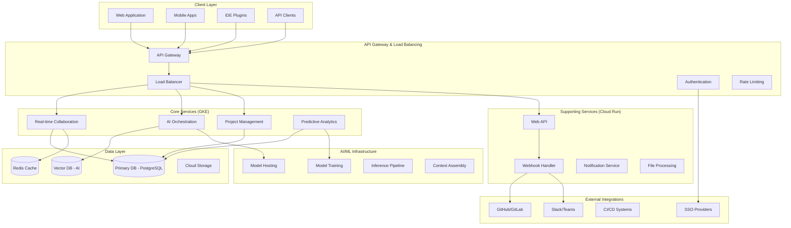

# System Architecture Overview

## Executive Summary

The AI-powered software development orchestration platform is built on a **cloud-native, microservices architecture** designed for enterprise scale, security, and performance. The system combines real-time collaboration, AI orchestration, and multi-tenant SaaS delivery to support thousands of concurrent users across global development teams.

## High-Level Architecture



## Core Architectural Principles

### 1. Cloud-Native Design
- **Containerized**: All services run in Docker containers
- **Orchestrated**: Kubernetes (GKE) for stateful services
- **Serverless**: Cloud Run for stateless HTTP services
- **Auto-scaling**: Horizontal scaling based on demand

### 2. Multi-Tenant Architecture
- **Shared Infrastructure**: Cost-effective resource utilization
- **Data Isolation**: Tenant-specific data partitioning
- **Security Boundaries**: Strong authentication and authorization
- **Customization**: Per-tenant configuration and branding

### 3. Event-Driven Architecture
- **Asynchronous Processing**: Non-blocking operations
- **Pub/Sub Messaging**: Decoupled service communication
- **Event Sourcing**: Audit trails and state reconstruction
- **Real-time Updates**: WebSocket-based live collaboration

### 4. AI-First Design
- **Context-Aware**: AI has access to full project context
- **Privacy-Preserving**: Tenant data isolation in AI processing
- **Scalable Inference**: On-demand model serving
- **Continuous Learning**: Model improvement through feedback

## Technology Stack

### Frontend
- **Framework**: React 18+ with TypeScript
- **State Management**: Redux Toolkit + RTK Query
- **UI Components**: Custom design system
- **Real-time**: WebSocket client with reconnection
- **Mobile**: React Native for mobile apps

### Backend Services
- **Runtime**: Node.js 20+ with TypeScript
- **Framework**: Express.js with custom middleware
- **Authentication**: OAuth 2.1 / OpenID Connect
- **API**: REST + GraphQL for complex queries
- **Real-time**: Socket.io for WebSocket management

### Data Storage
- **Primary Database**: PostgreSQL 15+ (Cloud SQL)
- **Caching**: Redis 7+ (Memorystore)
- **Vector Database**: Pinecone or Weaviate for AI embeddings
- **File Storage**: Google Cloud Storage
- **Search**: Elasticsearch for full-text search

### AI/ML Infrastructure
- **Model Hosting**: Vertex AI + custom GPU clusters
- **Training**: GKE with GPU nodes for model fine-tuning
- **Inference**: Auto-scaling inference endpoints
- **Context**: RAG (Retrieval-Augmented Generation) pipeline

### Infrastructure
- **Cloud Provider**: Google Cloud Platform
- **Container Orchestration**: Google Kubernetes Engine (GKE)
- **Serverless**: Cloud Run for stateless services
- **Networking**: VPC with private service connect
- **Monitoring**: Cloud Monitoring + Jaeger tracing

## Service Architecture

### Core Services (GKE - Stateful)

#### Real-time Collaboration Service
```typescript
interface CollaborationService {
  // WebSocket connection management
  connectionManager: WebSocketManager;
  
  // Operational Transform for conflict resolution
  otEngine: OperationalTransformEngine;
  
  // Document state management
  documentStore: DistributedDocumentStore;
  
  // Presence tracking
  presenceManager: PresenceManager;
}
```

**Responsibilities:**
- Manage 1000+ concurrent WebSocket connections
- Apply Operational Transform for conflict-free editing
- Broadcast changes to all connected clients
- Track user presence and cursor positions

#### AI Orchestration Service
```typescript
interface AIOrchestrationService {
  // Model Context Protocol implementation
  mcpServer: MCPServer;
  
  // AI model management
  modelManager: ModelManager;
  
  // Context assembly for AI requests
  contextAssembler: ContextAssembler;
  
  // Tool execution sandbox
  toolSandbox: ToolSandbox;
}
```

**Responsibilities:**
- Orchestrate AI model interactions via MCP
- Assemble context from project data for AI requests
- Execute AI tools in sandboxed environments
- Manage model versioning and A/B testing

#### Project Management Service
```typescript
interface ProjectService {
  // Project lifecycle management
  projectManager: ProjectManager;
  
  // Task and workflow orchestration
  workflowEngine: WorkflowEngine;
  
  // Dependency management
  dependencyTracker: DependencyTracker;
  
  // Predictive analytics
  analyticsEngine: AnalyticsEngine;
}
```

**Responsibilities:**
- Manage project lifecycle and metadata
- Execute workflow automation rules
- Track task dependencies and critical path
- Generate predictive analytics and risk assessments

### Supporting Services (Cloud Run - Stateless)

#### Web API Service
- RESTful API for client applications
- GraphQL endpoint for complex queries
- Authentication and authorization middleware
- Request validation and rate limiting

#### Webhook Handler Service
- Process incoming webhooks from external systems
- Transform and route events to appropriate services
- Retry logic for failed deliveries
- Security validation and signature verification

#### Notification Service
- Multi-channel notification delivery (email, Slack, push)
- Template management and personalization
- Delivery tracking and analytics
- User preference management

#### File Processing Service
- Document parsing and analysis
- Image processing and optimization
- AI-powered content extraction
- Virus scanning and security validation

## Data Architecture

### Database Design

#### Multi-Tenant Data Model
```sql
-- Shared schema with tenant isolation
CREATE TABLE organizations (
  id UUID PRIMARY KEY,
  name VARCHAR(255) NOT NULL,
  created_at TIMESTAMP DEFAULT NOW()
);

CREATE TABLE projects (
  id UUID PRIMARY KEY,
  organization_id UUID REFERENCES organizations(id),
  name VARCHAR(255) NOT NULL,
  -- All queries filtered by organization_id
);

-- Row-level security policy
CREATE POLICY tenant_isolation ON projects
  FOR ALL TO application_user
  USING (organization_id = current_setting('app.current_organization')::UUID);
```

#### Document Storage Model
```sql
-- Real-time document storage
CREATE TABLE documents (
  id UUID PRIMARY KEY,
  project_id UUID REFERENCES projects(id),
  type VARCHAR(50) NOT NULL, -- 'design_doc', 'requirements', 'architecture'
  content JSONB NOT NULL,
  version INTEGER NOT NULL,
  operations JSONB[], -- OT operations log
  created_at TIMESTAMP DEFAULT NOW()
);

-- Operational Transform operations
CREATE TABLE operations (
  id UUID PRIMARY KEY,
  document_id UUID REFERENCES documents(id),
  user_id UUID NOT NULL,
  operation JSONB NOT NULL,
  timestamp TIMESTAMP DEFAULT NOW(),
  applied BOOLEAN DEFAULT false
);
```

### Caching Strategy

#### Redis Cache Layers
```typescript
interface CacheStrategy {
  // L1: Application cache (in-memory)
  applicationCache: Map<string, any>;
  
  // L2: Redis cache (distributed)
  distributedCache: RedisClient;
  
  // L3: Database (persistent)
  database: PostgreSQLClient;
}

// Cache patterns
const cachePatterns = {
  // User sessions (TTL: 24 hours)
  session: 'session:{userId}',
  
  // Project metadata (TTL: 1 hour)
  project: 'project:{projectId}',
  
  // AI model responses (TTL: 7 days)
  aiResponse: 'ai:{hash}',
  
  // Real-time document state (TTL: 1 hour)
  document: 'doc:{documentId}'
};
```

## Real-Time Collaboration Architecture

### Operational Transform Implementation

```typescript
class OperationalTransformEngine {
  // Transform operations for concurrent editing
  transform(op1: Operation, op2: Operation): [Operation, Operation] {
    // Implement transformation rules based on operation types
    switch (op1.type) {
      case 'insert':
        return this.transformInsert(op1, op2);
      case 'delete':
        return this.transformDelete(op1, op2);
      case 'retain':
        return this.transformRetain(op1, op2);
    }
  }
  
  // Apply operation to document
  apply(document: Document, operation: Operation): Document {
    const newContent = this.applyOperation(document.content, operation);
    return {
      ...document,
      content: newContent,
      version: document.version + 1
    };
  }
}
```

### WebSocket Connection Management

```typescript
class WebSocketManager {
  private connections = new Map<string, WebSocket>();
  private documentSessions = new Map<string, Set<string>>();
  
  // Handle new client connections
  handleConnection(ws: WebSocket, userId: string, documentId: string) {
    this.connections.set(userId, ws);
    this.joinDocument(userId, documentId);
    
    ws.on('operation', (op) => this.handleOperation(userId, documentId, op));
    ws.on('cursor', (cursor) => this.broadcastCursor(userId, documentId, cursor));
    ws.on('disconnect', () => this.handleDisconnection(userId, documentId));
  }
  
  // Broadcast operation to all document participants
  broadcastOperation(documentId: string, operation: Operation, excludeUser?: string) {
    const participants = this.documentSessions.get(documentId);
    participants?.forEach(userId => {
      if (userId !== excludeUser) {
        const ws = this.connections.get(userId);
        ws?.send(JSON.stringify({ type: 'operation', operation }));
      }
    });
  }
}
```

## AI Architecture

### Model Context Protocol (MCP) Integration

```typescript
class MCPServer {
  private tools = new Map<string, Tool>();
  private models = new Map<string, AIModel>();
  
  // Register available tools
  registerTool(tool: Tool) {
    this.tools.set(tool.name, tool);
  }
  
  // Handle AI requests
  async handleRequest(request: MCPRequest): Promise<MCPResponse> {
    const context = await this.assembleContext(request);
    const model = this.selectModel(request.type);
    
    const response = await model.process(request.prompt, context);
    
    // Execute any tool calls
    if (response.toolCalls) {
      const toolResults = await this.executeTools(response.toolCalls);
      return this.formatResponse(response, toolResults);
    }
    
    return this.formatResponse(response);
  }
}
```

### Context Assembly Pipeline

```typescript
class ContextAssembler {
  async assembleContext(request: MCPRequest): Promise<AIContext> {
    const projectContext = await this.getProjectContext(request.projectId);
    const userContext = await this.getUserContext(request.userId);
    const documentContext = await this.getDocumentContext(request.documentId);
    
    // Retrieve relevant embeddings
    const embeddings = await this.vectorSearch(request.query);
    
    return {
      project: projectContext,
      user: userContext,
      document: documentContext,
      relevantCode: embeddings.code,
      relevantDocs: embeddings.documents,
      conversationHistory: await this.getConversationHistory(request.sessionId)
    };
  }
}
```

## Security Architecture

### Zero Trust Implementation

```typescript
class SecurityManager {
  // Validate every request
  async validateRequest(request: Request): Promise<SecurityContext> {
    const token = await this.extractToken(request);
    const claims = await this.validateToken(token);
    const permissions = await this.getPermissions(claims.userId, claims.organizationId);
    
    return {
      userId: claims.userId,
      organizationId: claims.organizationId,
      permissions: permissions,
      riskScore: await this.calculateRiskScore(request, claims)
    };
  }
  
  // Enforce authorization
  enforceAuthorization(resource: string, action: string, context: SecurityContext): boolean {
    return this.policyEngine.evaluate(resource, action, context);
  }
}
```

### Encryption Strategy

```typescript
interface EncryptionStrategy {
  // Data at rest encryption
  databaseEncryption: 'AES-256-GCM';
  
  // Data in transit encryption
  networkEncryption: 'TLS 1.3';
  
  // Application-level encryption for sensitive fields
  fieldEncryption: {
    algorithm: 'AES-256-GCM';
    keyRotation: '90 days';
    keyManagement: 'Google Cloud KMS';
  };
  
  // End-to-end encryption for AI processing
  aiEncryption: {
    contextEncryption: boolean;
    modelInputEncryption: boolean;
    responseEncryption: boolean;
  };
}
```

## Performance & Scalability

### Auto-Scaling Configuration

```yaml
# GKE Horizontal Pod Autoscaler
apiVersion: autoscaling/v2
kind: HorizontalPodAutoscaler
metadata:
  name: collaboration-service-hpa
spec:
  scaleTargetRef:
    apiVersion: apps/v1
    kind: Deployment
    name: collaboration-service
  minReplicas: 3
  maxReplicas: 50
  metrics:
  - type: Resource
    resource:
      name: cpu
      target:
        type: Utilization
        averageUtilization: 70
  - type: Resource
    resource:
      name: memory
      target:
        type: Utilization
        averageUtilization: 80
  - type: Pods
    pods:
      metric:
        name: websocket_connections
      target:
        type: AverageValue
        averageValue: "100"
```

### Database Performance

```sql
-- Partitioning strategy for large tables
CREATE TABLE operations_2025_01 PARTITION OF operations
FOR VALUES FROM ('2025-01-01') TO ('2025-02-01');

-- Optimized indexes for common queries
CREATE INDEX CONCURRENTLY idx_projects_org_created 
ON projects (organization_id, created_at DESC);

CREATE INDEX CONCURRENTLY idx_operations_doc_timestamp 
ON operations (document_id, timestamp DESC);

-- Connection pooling configuration
-- Max connections: 1000
-- Pool size per service: 50
-- Connection timeout: 30s
```

## Monitoring & Observability

### Distributed Tracing

```typescript
// OpenTelemetry configuration
const tracer = trace.getTracer('ai-orchestration-platform', '1.0.0');

class RequestTracing {
  async traceRequest(request: Request, handler: Function) {
    const span = tracer.startSpan(`${request.method} ${request.path}`);
    
    span.setAttributes({
      'http.method': request.method,
      'http.url': request.url,
      'user.id': request.user?.id,
      'organization.id': request.user?.organizationId
    });
    
    try {
      const result = await handler(request);
      span.setStatus({ code: SpanStatusCode.OK });
      return result;
    } catch (error) {
      span.recordException(error);
      span.setStatus({ 
        code: SpanStatusCode.ERROR, 
        message: error.message 
      });
      throw error;
    } finally {
      span.end();
    }
  }
}
```

### Health Checks

```typescript
class HealthChecker {
  async checkSystemHealth(): Promise<HealthStatus> {
    return {
      overall: 'healthy',
      services: {
        database: await this.checkDatabase(),
        cache: await this.checkRedis(),
        aiModels: await this.checkAIModels(),
        externalAPIs: await this.checkExternalIntegrations()
      },
      metrics: {
        activeConnections: this.getActiveConnections(),
        responseTime: this.getAverageResponseTime(),
        errorRate: this.getErrorRate()
      }
    };
  }
}
```

## Deployment Architecture

### Infrastructure as Code

```terraform
# GKE cluster configuration
resource "google_container_cluster" "ai_orchestration" {
  name     = "ai-orchestration-cluster"
  location = var.region
  
  initial_node_count = 3
  
  node_config {
    machine_type = "n2-standard-4"
    disk_size_gb = 100
    
    oauth_scopes = [
      "https://www.googleapis.com/auth/cloud-platform"
    ]
  }
  
  # Enable workload identity
  workload_identity_config {
    workload_pool = "${var.project_id}.svc.id.goog"
  }
}

# Cloud SQL instance
resource "google_sql_database_instance" "primary" {
  name             = "ai-orchestration-db"
  database_version = "POSTGRES_15"
  region           = var.region
  
  settings {
    tier = "db-n1-standard-4"
    
    backup_configuration {
      enabled                        = true
      start_time                     = "03:00"
      point_in_time_recovery_enabled = true
    }
  }
}
```

### CI/CD Pipeline

```yaml
# GitHub Actions workflow
name: Deploy to GCP
on:
  push:
    branches: [main]

jobs:
  test:
    runs-on: ubuntu-latest
    steps:
      - uses: actions/checkout@v4
      - uses: actions/setup-node@v4
        with:
          node-version: '20'
      - run: npm ci
      - run: npm test
      - run: npm run lint
      - run: npm run type-check

  build-and-deploy:
    needs: test
    runs-on: ubuntu-latest
    steps:
      - uses: actions/checkout@v4
      - uses: google-github-actions/setup-gcloud@v1
      - run: |
          docker build -t gcr.io/$PROJECT_ID/ai-orchestration:$GITHUB_SHA .
          docker push gcr.io/$PROJECT_ID/ai-orchestration:$GITHUB_SHA
      - run: |
          kubectl set image deployment/ai-orchestration \
            ai-orchestration=gcr.io/$PROJECT_ID/ai-orchestration:$GITHUB_SHA
```

---

*Last Updated: January 2025*
*Architecture Review: Quarterly*
*Performance Review: Monthly*