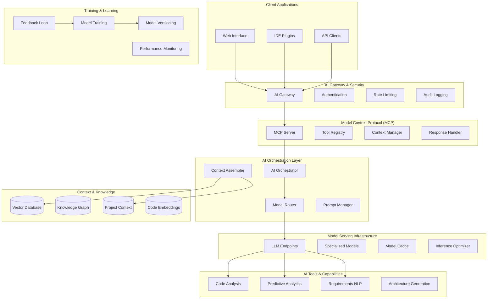

# AI/ML Architecture & Implementation

## Executive Summary

The AI/ML architecture forms the intelligence backbone of the platform, providing **context-aware AI assistance** throughout the software development lifecycle. Built on modern LLM infrastructure with privacy-preserving multi-tenancy, the system delivers predictive analytics, automated code analysis, and intelligent project orchestration.

## AI Architecture Overview



## Core AI Capabilities

### 1. Advanced Code Analysis & Intelligence

#### LLM-Based Code Review Engine
```typescript
interface CodeReviewEngine {
  // Multi-model code analysis
  analyzeCode(codeChanges: CodeDiff[], context: ProjectContext): Promise<CodeReviewResult>;
  
  // Architecture conformance checking
  validateArchitecture(code: CodeBase, designSpec: ArchitectureSpec): Promise<ConformanceReport>;
  
  // Security vulnerability detection
  scanSecurity(codeChanges: CodeDiff[]): Promise<SecurityReport>;
  
  // Performance optimization suggestions
  optimizePerformance(codeProfile: PerformanceProfile): Promise<OptimizationSuggestions>;
}

class CodeReviewEngine implements CodeReviewEngine {
  async analyzeCode(codeChanges: CodeDiff[], context: ProjectContext): Promise<CodeReviewResult> {
    const prompt = this.buildCodeReviewPrompt(codeChanges, context);
    
    // Use specialized code model for analysis
    const analysis = await this.modelRouter.route({
      modelType: 'code-analysis',
      prompt: prompt,
      context: {
        projectArchitecture: context.architecture,
        codingStandards: context.standards,
        previousReviews: context.reviewHistory
      }
    });
    
    return {
      overallScore: analysis.qualityScore,
      issues: analysis.issues.map(this.categorizeIssue),
      suggestions: analysis.improvements,
      architectureCompliance: await this.checkArchitectureCompliance(codeChanges, context),
      securityFindings: await this.scanForSecurityIssues(codeChanges),
      testCoverage: analysis.testingRecommendations
    };
  }
  
  private async checkArchitectureCompliance(
    codeChanges: CodeDiff[], 
    context: ProjectContext
  ): Promise<ArchitectureCompliance> {
    // Compare code structure against design documents
    const designPatterns = await this.extractDesignPatterns(context.architecture);
    const codePatterns = await this.analyzeCodePatterns(codeChanges);
    
    return {
      conformanceScore: this.calculateConformance(designPatterns, codePatterns),
      violations: this.detectViolations(designPatterns, codePatterns),
      recommendations: this.generateComplianceRecommendations(designPatterns, codePatterns)
    };
  }
}
```

#### Technical Debt Quantification System
```typescript
interface TechnicalDebtAnalyzer {
  // CISQ-based technical debt measurement
  measureTechnicalDebt(codebase: CodeBase): Promise<TechnicalDebtReport>;
  
  // Business impact analysis
  calculateBusinessImpact(debtMetrics: DebtMetrics, projectMetrics: ProjectMetrics): Promise<BusinessImpact>;
  
  // Prioritized remediation roadmap
  generateRemediationPlan(debtReport: TechnicalDebtReport): Promise<RemediationPlan>;
}

class TechnicalDebtAnalyzer implements TechnicalDebtAnalyzer {
  async measureTechnicalDebt(codebase: CodeBase): Promise<TechnicalDebtReport> {
    // Multi-dimensional analysis
    const complexity = await this.analyzeCyclomaticComplexity(codebase);
    const duplication = await this.detectCodeDuplication(codebase);
    const coverage = await this.analyzeTestCoverage(codebase);
    const dependencies = await this.analyzeDependencyHealth(codebase);
    
    // AI-powered debt assessment
    const aiAssessment = await this.getAIDebtAssessment(codebase);
    
    return {
      totalDebtHours: this.calculateTotalDebt(complexity, duplication, coverage),
      debtByModule: this.categorizeDebtByModule(codebase),
      severity: this.categorizeSeverity(aiAssessment),
      trends: await this.analyzeTrends(codebase),
      prioritizedItems: this.prioritizeDebtItems(aiAssessment)
    };
  }
  
  async calculateBusinessImpact(
    debtMetrics: DebtMetrics, 
    projectMetrics: ProjectMetrics
  ): Promise<BusinessImpact> {
    // Predict impact on development velocity
    const velocityImpact = await this.predictVelocityImpact(debtMetrics, projectMetrics);
    
    // Calculate maintenance cost increase
    const maintenanceCost = this.estimateMaintenanceCostIncrease(debtMetrics);
    
    // Risk assessment for production issues
    const riskAssessment = await this.assessProductionRisk(debtMetrics);
    
    return {
      developmentSlowdown: velocityImpact.percentageSlowdown,
      additionalMaintenanceCost: maintenanceCost.annualCostIncrease,
      productionRiskScore: riskAssessment.riskLevel,
      recommendedInvestment: this.calculateOptimalInvestment(debtMetrics),
      paybackPeriod: this.estimatePaybackPeriod(debtMetrics, projectMetrics)
    };
  }
}
```

### 2. Predictive Project Analytics

#### Machine Learning Pipeline for Project Success Prediction
```typescript
interface ProjectSuccessPrediction {
  // Real-time project health scoring
  calculateProjectHealth(project: Project, currentMetrics: ProjectMetrics): Promise<HealthScore>;
  
  // Timeline and budget forecasting
  forecastProjectOutcome(project: Project, historicalData: ProjectHistory[]): Promise<ProjectForecast>;
  
  // Risk factor identification and mitigation
  identifyRisks(project: Project, teamMetrics: TeamMetrics): Promise<RiskAssessment>;
  
  // Resource optimization recommendations
  optimizeResources(project: Project, constraints: ResourceConstraints): Promise<ResourcePlan>;
}

class ProjectAnalyticsEngine implements ProjectSuccessPrediction {
  private mlModels: {
    successPrediction: MLModel;
    timelinePrediction: MLModel;
    riskAssessment: MLModel;
    resourceOptimization: MLModel;
  };
  
  async calculateProjectHealth(
    project: Project, 
    currentMetrics: ProjectMetrics
  ): Promise<HealthScore> {
    // Feature engineering for ML model
    const features = this.extractProjectFeatures(project, currentMetrics);
    
    // Ensemble prediction using multiple models
    const predictions = await Promise.all([
      this.mlModels.successPrediction.predict(features),
      this.mlModels.timelinePrediction.predict(features),
      this.mlModels.riskAssessment.predict(features)
    ]);
    
    // Weighted scoring algorithm
    const healthScore = this.calculateWeightedHealth(predictions, project.priority);
    
    return {
      overallScore: healthScore.score,
      confidence: healthScore.confidence,
      factors: this.explainHealthFactors(features, predictions),
      trend: await this.calculateHealthTrend(project.id),
      alerts: this.generateHealthAlerts(healthScore, project)
    };
  }
  
  async forecastProjectOutcome(
    project: Project, 
    historicalData: ProjectHistory[]
  ): Promise<ProjectForecast> {
    // Time series analysis for timeline prediction
    const timelineFeatures = this.buildTimelineFeatures(project, historicalData);
    const timelinePrediction = await this.mlModels.timelinePrediction.predict(timelineFeatures);
    
    // Monte Carlo simulation for confidence intervals
    const scenarios = await this.runMonteCarloSimulation(project, historicalData, 1000);
    
    return {
      expectedCompletionDate: timelinePrediction.expectedDate,
      confidenceInterval: {
        early: scenarios.percentile(10),
        likely: scenarios.percentile(50),
        late: scenarios.percentile(90)
      },
      budgetForecast: this.forecastBudget(project, timelinePrediction),
      qualityForecast: this.forecastQuality(project, historicalData),
      scenarioAnalysis: this.generateScenarios(scenarios)
    };
  }
  
  async identifyRisks(
    project: Project, 
    teamMetrics: TeamMetrics
  ): Promise<RiskAssessment> {
    // Multi-model risk detection
    const riskFeatures = this.buildRiskFeatures(project, teamMetrics);
    const riskPredictions = await this.mlModels.riskAssessment.predict(riskFeatures);
    
    // Industry benchmark comparison
    const benchmarks = await this.getBenchmarkData(project.industry, project.size);
    
    return {
      riskScore: riskPredictions.overallRisk,
      riskFactors: this.categorizeRisks(riskPredictions.factors),
      mitigationStrategies: await this.generateMitigationStrategies(riskPredictions),
      benchmarkComparison: this.compareToBenchmarks(riskPredictions, benchmarks),
      earlyWarningSignals: this.defineEarlyWarnings(riskPredictions)
    };
  }
}
```

#### Stakeholder Sentiment Analysis
```typescript
interface StakeholderSentimentAnalyzer {
  // Communication sentiment tracking
  analyzeCommunications(communications: Communication[]): Promise<SentimentReport>;
  
  // Meeting sentiment analysis
  analyzeMeetingTranscripts(transcripts: MeetingTranscript[]): Promise<MeetingSentiment>;
  
  // Stakeholder engagement scoring
  scoreStakeholderEngagement(stakeholders: Stakeholder[]): Promise<EngagementScore>;
}

class SentimentAnalysisEngine implements StakeholderSentimentAnalyzer {
  async analyzeCommunications(communications: Communication[]): Promise<SentimentReport> {
    // Process multiple communication channels
    const emailSentiment = await this.analyzeEmails(communications.emails);
    const slackSentiment = await this.analyzeSlackMessages(communications.slack);
    const commentSentiment = await this.analyzeComments(communications.comments);
    
    // Aggregate sentiment trends
    const overallSentiment = this.aggregateSentiment([
      emailSentiment,
      slackSentiment,
      commentSentiment
    ]);
    
    return {
      overallSentiment: overallSentiment.score,
      sentimentTrend: overallSentiment.trend,
      stakeholderBreakdown: this.groupByStakeholder(overallSentiment),
      alertThresholds: this.checkAlertThresholds(overallSentiment),
      recommendedActions: await this.generateSentimentActions(overallSentiment)
    };
  }
  
  private async analyzeEmails(emails: Email[]): Promise<ChannelSentiment> {
    const sentimentPromises = emails.map(async email => {
      // Use NLP model for sentiment analysis
      const sentiment = await this.nlpModel.analyzeSentiment(email.content);
      
      return {
        messageId: email.id,
        sender: email.from,
        sentiment: sentiment.score,
        confidence: sentiment.confidence,
        topics: await this.extractTopics(email.content),
        urgency: await this.detectUrgency(email.content)
      };
    });
    
    const sentiments = await Promise.all(sentimentPromises);
    
    return this.aggregateChannelSentiment(sentiments);
  }
}
```

### 3. Natural Language Processing for Requirements

#### Requirements Extraction and Analysis
```typescript
interface RequirementsProcessor {
  // Extract requirements from conversations
  extractFromConversations(transcripts: ConversationTranscript[]): Promise<ExtractedRequirements>;
  
  // Detect ambiguity and inconsistencies
  validateRequirements(requirements: Requirement[]): Promise<ValidationReport>;
  
  // Generate user stories and acceptance criteria
  generateUserStories(requirements: Requirement[]): Promise<UserStory[]>;
  
  // Cross-reference with existing specifications
  linkToExistingSpecs(requirements: Requirement[], specs: Specification[]): Promise<RequirementLinks>;
}

class RequirementsNLPEngine implements RequirementsProcessor {
  async extractFromConversations(
    transcripts: ConversationTranscript[]
  ): Promise<ExtractedRequirements> {
    // Process each conversation transcript
    const extractionPromises = transcripts.map(async transcript => {
      // Named Entity Recognition for software concepts
      const entities = await this.extractSoftwareEntities(transcript.content);
      
      // Intent classification for requirement types
      const intents = await this.classifyIntents(transcript.content);
      
      // Dependency extraction
      const dependencies = await this.extractDependencies(transcript.content);
      
      return {
        transcriptId: transcript.id,
        extractedRequirements: entities.requirements,
        stakeholderIntents: intents,
        identifiedDependencies: dependencies,
        confidence: this.calculateExtractionConfidence(entities, intents)
      };
    });
    
    const extractions = await Promise.all(extractionPromises);
    
    return {
      requirements: this.consolidateRequirements(extractions),
      stakeholderMapping: this.mapStakeholderIntents(extractions),
      dependencyGraph: this.buildDependencyGraph(extractions),
      confidenceReport: this.generateConfidenceReport(extractions)
    };
  }
  
  async validateRequirements(requirements: Requirement[]): Promise<ValidationReport> {
    const validationIssues: ValidationIssue[] = [];
    
    // Ambiguity detection
    for (const requirement of requirements) {
      const ambiguityCheck = await this.detectAmbiguity(requirement.description);
      if (ambiguityCheck.hasAmbiguity) {
        validationIssues.push({
          requirementId: requirement.id,
          type: 'ambiguity',
          severity: ambiguityCheck.severity,
          description: ambiguityCheck.explanation,
          suggestions: ambiguityCheck.suggestions
        });
      }
      
      // Consistency checking against other requirements
      const consistencyIssues = await this.checkConsistency(requirement, requirements);
      validationIssues.push(...consistencyIssues);
      
      // Completeness validation
      const completenessIssues = await this.validateCompleteness(requirement);
      validationIssues.push(...completenessIssues);
    }
    
    return {
      overallScore: this.calculateValidationScore(validationIssues),
      issues: validationIssues,
      recommendations: await this.generateValidationRecommendations(validationIssues),
      prioritizedFixes: this.prioritizeIssues(validationIssues)
    };
  }
  
  async generateUserStories(requirements: Requirement[]): Promise<UserStory[]> {
    const userStoryPromises = requirements.map(async requirement => {
      // Identify user personas from requirement
      const personas = await this.identifyPersonas(requirement);
      
      // Extract user goals and motivations
      const goals = await this.extractUserGoals(requirement);
      
      // Generate acceptance criteria
      const acceptanceCriteria = await this.generateAcceptanceCriteria(requirement);
      
      return {
        id: this.generateUserStoryId(),
        title: await this.generateStoryTitle(requirement),
        asA: personas.primary,
        iWant: goals.primary,
        soThat: goals.motivation,
        acceptanceCriteria: acceptanceCriteria,
        sourceRequirement: requirement.id,
        estimatedComplexity: await this.estimateComplexity(requirement),
        dependencies: await this.identifyStoryDependencies(requirement, requirements)
      };
    });
    
    return Promise.all(userStoryPromises);
  }
}
```

### 4. AI-Driven Workflow Orchestration

#### Intelligent Task Scheduling and Resource Allocation
```typescript
interface WorkflowOrchestrator {
  // Optimize task scheduling across team members
  optimizeSchedule(tasks: Task[], team: TeamMember[], constraints: Constraint[]): Promise<OptimizedSchedule>;
  
  // Dynamic re-planning based on progress and changes
  replanDynamically(currentState: ProjectState, changes: Change[]): Promise<UpdatedPlan>;
  
  // Workload balancing across team members
  balanceWorkload(assignments: Assignment[], teamCapacity: TeamCapacity): Promise<BalancedWorkload>;
  
  // Dependency management and critical path optimization
  optimizeCriticalPath(tasks: Task[], dependencies: Dependency[]): Promise<CriticalPathPlan>;
}

class AIWorkflowOrchestrator implements WorkflowOrchestrator {
  private schedulingModel: ConstraintSolvingModel;
  private optimizationEngine: OptimizationEngine;
  
  async optimizeSchedule(
    tasks: Task[], 
    team: TeamMember[], 
    constraints: Constraint[]
  ): Promise<OptimizedSchedule> {
    // Build constraint satisfaction problem
    const csp = this.buildCSP(tasks, team, constraints);
    
    // Multi-objective optimization
    const objectives = [
      this.minimizeCompletionTime,
      this.maximizeTeamUtilization,
      this.minimizeContextSwitching,
      this.balanceWorkload
    ];
    
    const solution = await this.schedulingModel.solve(csp, objectives);
    
    return {
      schedule: solution.assignments,
      expectedCompletion: solution.timeline.end,
      utilizationMetrics: this.calculateUtilization(solution, team),
      riskFactors: await this.identifyScheduleRisks(solution),
      alternatives: await this.generateAlternativeSchedules(csp, objectives, 3)
    };
  }
  
  async replanDynamically(
    currentState: ProjectState, 
    changes: Change[]
  ): Promise<UpdatedPlan> {
    // Analyze impact of changes
    const impactAnalysis = await this.analyzeChangeImpact(currentState, changes);
    
    // Re-optimize affected portions of the plan
    const affectedTasks = this.identifyAffectedTasks(impactAnalysis);
    const newSchedule = await this.reoptimizeTasks(affectedTasks, currentState);
    
    // Cascade impact analysis
    const cascadeEffects = await this.analyzeCascadeEffects(newSchedule, currentState);
    
    return {
      updatedSchedule: newSchedule,
      impactSummary: impactAnalysis.summary,
      cascadeEffects: cascadeEffects,
      communicationPlan: await this.generateCommunicationPlan(changes, impactAnalysis),
      rollbackPlan: this.generateRollbackPlan(currentState, newSchedule)
    };
  }
  
  async balanceWorkload(
    assignments: Assignment[], 
    teamCapacity: TeamCapacity
  ): Promise<BalancedWorkload> {
    // Calculate current workload distribution
    const currentDistribution = this.calculateWorkloadDistribution(assignments, teamCapacity);
    
    // Identify overloaded and underutilized team members
    const imbalances = this.identifyImbalances(currentDistribution);
    
    // Generate rebalancing recommendations
    const rebalancingOptions = await this.generateRebalancingOptions(imbalances, assignments);
    
    return {
      currentBalance: currentDistribution,
      imbalances: imbalances,
      recommendedChanges: rebalancingOptions.optimal,
      alternativeOptions: rebalancingOptions.alternatives,
      expectedImpact: await this.predictRebalancingImpact(rebalancingOptions.optimal)
    };
  }
}
```

## Model Serving Infrastructure

### Multi-Model Architecture
```typescript
interface ModelManager {
  // Route requests to appropriate models
  routeRequest(request: AIRequest): Promise<ModelEndpoint>;
  
  // Load balancing across model instances
  balanceLoad(modelType: string, currentLoad: LoadMetrics): Promise<ModelInstance>;
  
  // Model versioning and A/B testing
  manageVersions(modelType: string, versions: ModelVersion[]): Promise<VersioningStrategy>;
  
  // Cost optimization for model inference
  optimizeCosts(usageMetrics: UsageMetrics, budgetConstraints: Budget): Promise<CostOptimization>;
}

class ModelRouter implements ModelManager {
  private modelRegistry: Map<string, ModelEndpoint[]>;
  private loadBalancer: LoadBalancer;
  private costOptimizer: CostOptimizer;
  
  async routeRequest(request: AIRequest): Promise<ModelEndpoint> {
    // Select model based on request type and requirements
    const modelType = this.determineModelType(request);
    const availableEndpoints = this.modelRegistry.get(modelType) || [];
    
    // Consider latency, cost, and quality requirements
    const scoredEndpoints = await Promise.all(
      availableEndpoints.map(async endpoint => ({
        endpoint,
        score: await this.scoreEndpoint(endpoint, request.requirements)
      }))
    );
    
    // Select best endpoint
    const bestEndpoint = scoredEndpoints
      .sort((a, b) => b.score - a.score)[0]?.endpoint;
    
    if (!bestEndpoint) {
      throw new Error(`No available endpoints for model type: ${modelType}`);
    }
    
    return bestEndpoint;
  }
  
  private async scoreEndpoint(
    endpoint: ModelEndpoint, 
    requirements: RequestRequirements
  ): Promise<number> {
    const metrics = await endpoint.getMetrics();
    
    // Multi-factor scoring
    const latencyScore = this.scoreLatency(metrics.latency, requirements.maxLatency);
    const costScore = this.scoreCost(metrics.costPerToken, requirements.budget);
    const qualityScore = metrics.qualityScore;
    const availabilityScore = metrics.availability;
    
    // Weighted combination
    return (
      latencyScore * requirements.weights.latency +
      costScore * requirements.weights.cost +
      qualityScore * requirements.weights.quality +
      availabilityScore * requirements.weights.availability
    );
  }
}
```

### Model Performance Optimization
```typescript
interface PerformanceOptimizer {
  // Optimize inference latency
  optimizeLatency(model: Model, requirements: LatencyRequirements): Promise<OptimizedModel>;
  
  // Batch inference optimization
  optimizeBatching(requests: AIRequest[]): Promise<BatchedRequests>;
  
  // Caching strategies for repeated requests
  optimizeCaching(requestPatterns: RequestPattern[]): Promise<CacheStrategy>;
  
  // Model quantization and compression
  optimizeModelSize(model: Model, constraints: SizeConstraints): Promise<CompressedModel>;
}

class InferenceOptimizer implements PerformanceOptimizer {
  async optimizeLatency(
    model: Model, 
    requirements: LatencyRequirements
  ): Promise<OptimizedModel> {
    const optimizations: ModelOptimization[] = [];
    
    // GPU optimization
    if (requirements.maxLatency < 100) {
      optimizations.push({
        type: 'gpu-acceleration',
        technique: 'tensor-rt',
        expectedSpeedup: 2.5
      });
    }
    
    // Model quantization
    if (requirements.allowQualityTradeoff) {
      optimizations.push({
        type: 'quantization',
        technique: 'int8',
        expectedSpeedup: 1.8,
        qualityImpact: 0.02
      });
    }
    
    // Dynamic batching
    optimizations.push({
      type: 'dynamic-batching',
      technique: 'continuous-batching',
      expectedSpeedup: 1.5
    });
    
    return await this.applyOptimizations(model, optimizations);
  }
  
  async optimizeBatching(requests: AIRequest[]): Promise<BatchedRequests> {
    // Group requests by model type and compatibility
    const compatibilityGroups = this.groupByCompatibility(requests);
    
    // Optimize batch sizes for each group
    const optimizedBatches = compatibilityGroups.map(group => {
      const optimalBatchSize = this.calculateOptimalBatchSize(
        group.modelType,
        group.requests.length,
        group.averageTokenLength
      );
      
      return this.createBatches(group.requests, optimalBatchSize);
    });
    
    return {
      batches: optimizedBatches.flat(),
      expectedLatencyReduction: this.calculateLatencyReduction(requests, optimizedBatches),
      costSavings: this.calculateCostSavings(requests, optimizedBatches)
    };
  }
}
```

## Privacy & Security for AI

### Privacy-Preserving AI Architecture
```typescript
interface PrivacyManager {
  // Tenant data isolation for AI processing
  isolateTenantData(request: AIRequest, tenantId: string): Promise<IsolatedContext>;
  
  // Differential privacy for aggregated learning
  applyDifferentialPrivacy(data: TrainingData, epsilon: number): Promise<PrivateData>;
  
  // Secure multi-party computation for cross-tenant insights
  computeSecureAggregation(tenantData: TenantData[]): Promise<AggregatedInsights>;
  
  // Homomorphic encryption for sensitive data processing
  processEncryptedData(encryptedData: EncryptedInput): Promise<EncryptedOutput>;
}

class AIPrivacyManager implements PrivacyManager {
  async isolateTenantData(
    request: AIRequest, 
    tenantId: string
  ): Promise<IsolatedContext> {
    // Create tenant-specific context sandbox
    const sandbox = await this.createTenantSandbox(tenantId);
    
    // Load only tenant-specific data and embeddings
    const tenantContext = await this.loadTenantContext(tenantId, sandbox);
    
    // Ensure no cross-tenant data leakage
    const isolatedRequest = await this.sanitizeRequest(request, tenantId);
    
    return {
      sandbox: sandbox,
      context: tenantContext,
      request: isolatedRequest,
      auditTrail: this.createAuditTrail(request, tenantId)
    };
  }
  
  async applyDifferentialPrivacy(
    data: TrainingData, 
    epsilon: number
  ): Promise<PrivateData> {
    // Add calibrated noise for differential privacy
    const noiseMechanism = new LaplaceMechanism(epsilon);
    
    // Apply privacy-preserving transformations
    const privateData = await Promise.all(
      data.samples.map(async sample => {
        const noisySample = await noiseMechanism.addNoise(sample);
        return this.validatePrivacyBounds(noisySample, epsilon);
      })
    );
    
    return {
      data: privateData,
      privacyBudget: epsilon,
      privacyGuarantee: this.calculatePrivacyGuarantee(epsilon),
      utilityMetrics: await this.calculateUtilityRetention(data, privateData)
    };
  }
}
```

### AI Security Framework
```typescript
interface AISecurityManager {
  // Prompt injection detection and prevention
  detectPromptInjection(prompt: string): Promise<SecurityAssessment>;
  
  // Model output sanitization
  sanitizeOutput(output: string, context: SecurityContext): Promise<SanitizedOutput>;
  
  // Rate limiting and abuse prevention
  enforceRateLimits(userId: string, request: AIRequest): Promise<RateLimitDecision>;
  
  // Model behavior monitoring and anomaly detection
  monitorModelBehavior(model: Model, outputs: ModelOutput[]): Promise<BehaviorReport>;
}

class AISecurityFramework implements AISecurityManager {
  private injectionDetector: PromptInjectionDetector;
  private outputSanitizer: OutputSanitizer;
  private rateLimiter: RateLimiter;
  private behaviorMonitor: BehaviorMonitor;
  
  async detectPromptInjection(prompt: string): Promise<SecurityAssessment> {
    // Multi-layer injection detection
    const detectionResults = await Promise.all([
      this.injectionDetector.detectDirectInjection(prompt),
      this.injectionDetector.detectIndirectInjection(prompt),
      this.injectionDetector.detectRolePlayingAttempts(prompt),
      this.injectionDetector.detectDataExtractionAttempts(prompt)
    ]);
    
    const riskScore = this.calculateAggregateRiskScore(detectionResults);
    
    return {
      riskScore: riskScore,
      detectedTechniques: detectionResults.filter(r => r.detected).map(r => r.technique),
      confidence: this.calculateConfidence(detectionResults),
      recommendedAction: this.determineAction(riskScore),
      sanitizedPrompt: riskScore > 0.5 ? await this.sanitizePrompt(prompt) : prompt
    };
  }
  
  async sanitizeOutput(
    output: string, 
    context: SecurityContext
  ): Promise<SanitizedOutput> {
    // Multi-stage output sanitization
    const sanitizationSteps = [
      this.removeSensitiveInformation,
      this.validateOutputScope,
      this.checkForDataLeakage,
      this.enforceContentPolicies
    ];
    
    let sanitizedContent = output;
    const sanitizationLog: SanitizationStep[] = [];
    
    for (const step of sanitizationSteps) {
      const result = await step(sanitizedContent, context);
      sanitizedContent = result.content;
      sanitizationLog.push(result.log);
    }
    
    return {
      content: sanitizedContent,
      originalLength: output.length,
      sanitizedLength: sanitizedContent.length,
      sanitizationSteps: sanitizationLog,
      riskMitigation: this.calculateRiskMitigation(output, sanitizedContent)
    };
  }
}
```

## Training & Continuous Learning

### Feedback Loop Architecture
```typescript
interface FeedbackManager {
  // Collect user feedback on AI suggestions
  collectFeedback(interaction: AIInteraction, feedback: UserFeedback): Promise<void>;
  
  // Analyze feedback patterns for model improvement
  analyzeFeedbackPatterns(feedbackData: FeedbackData[]): Promise<ImprovementInsights>;
  
  // Trigger model retraining based on feedback
  triggerRetraining(insights: ImprovementInsights): Promise<RetrainingPlan>;
  
  // Validate improved model performance
  validateModelImprovement(oldModel: Model, newModel: Model): Promise<ValidationReport>;
}

class ContinuousLearningEngine implements FeedbackManager {
  async collectFeedback(
    interaction: AIInteraction, 
    feedback: UserFeedback
  ): Promise<void> {
    // Store feedback with context
    const feedbackRecord = {
      interactionId: interaction.id,
      userId: interaction.userId,
      tenantId: interaction.tenantId,
      modelVersion: interaction.modelVersion,
      prompt: interaction.prompt,
      response: interaction.response,
      feedback: {
        rating: feedback.rating,
        category: feedback.category,
        explanation: feedback.explanation,
        suggestedImprovement: feedback.suggestion
      },
      context: {
        projectType: interaction.context.projectType,
        userExpertise: interaction.context.userExpertise,
        taskComplexity: interaction.context.taskComplexity
      },
      timestamp: new Date()
    };
    
    await this.feedbackStore.store(feedbackRecord);
    
    // Trigger immediate analysis for critical feedback
    if (feedback.rating <= 2) {
      await this.analyzeCriticalFeedback(feedbackRecord);
    }
  }
  
  async analyzeFeedbackPatterns(feedbackData: FeedbackData[]): Promise<ImprovementInsights> {
    // Statistical analysis of feedback trends
    const patterns = {
      ratingDistribution: this.analyzeRatingDistribution(feedbackData),
      categoryTrends: this.analyzeCategoryTrends(feedbackData),
      contextCorrelations: this.analyzeContextCorrelations(feedbackData),
      temporalTrends: this.analyzeTemporalTrends(feedbackData)
    };
    
    // Identify specific improvement opportunities
    const opportunities = [
      ...this.identifyLowPerformanceAreas(patterns),
      ...this.identifyInconsistencies(patterns),
      ...this.identifyBiasPatterns(patterns)
    ];
    
    return {
      patterns: patterns,
      improvementOpportunities: opportunities,
      prioritizedActions: this.prioritizeImprovements(opportunities),
      estimatedImpact: await this.estimateImprovementImpact(opportunities)
    };
  }
  
  async triggerRetraining(insights: ImprovementInsights): Promise<RetrainingPlan> {
    // Determine retraining strategy
    const strategy = this.determineRetrainingStrategy(insights);
    
    // Prepare training data
    const trainingData = await this.prepareTrainingData(insights, strategy);
    
    // Create retraining plan
    return {
      strategy: strategy,
      trainingData: trainingData.summary,
      estimatedDuration: this.estimateTrainingDuration(trainingData, strategy),
      resourceRequirements: this.calculateResourceRequirements(strategy),
      validationPlan: this.createValidationPlan(insights),
      rollbackPlan: this.createRollbackPlan(),
      deploymentStrategy: this.planDeployment(strategy)
    };
  }
}
```

## Performance Monitoring & Optimization

### AI System Metrics
```typescript
interface AIMetricsCollector {
  // Model performance metrics
  collectModelMetrics(model: Model, timeWindow: TimeWindow): Promise<ModelMetrics>;
  
  // User satisfaction metrics
  collectSatisfactionMetrics(interactions: AIInteraction[]): Promise<SatisfactionMetrics>;
  
  // Cost and efficiency metrics
  collectEfficiencyMetrics(operations: AIOperation[]): Promise<EfficiencyMetrics>;
  
  // System health metrics
  collectSystemHealthMetrics(): Promise<SystemHealthMetrics>;
}

class AIPerformanceMonitor implements AIMetricsCollector {
  async collectModelMetrics(
    model: Model, 
    timeWindow: TimeWindow
  ): Promise<ModelMetrics> {
    const interactions = await this.getModelInteractions(model, timeWindow);
    
    return {
      // Quality metrics
      averageRating: this.calculateAverageRating(interactions),
      satisfactionRate: this.calculateSatisfactionRate(interactions),
      accuracyScore: await this.calculateAccuracyScore(interactions),
      
      // Performance metrics
      averageLatency: this.calculateAverageLatency(interactions),
      throughput: this.calculateThroughput(interactions),
      errorRate: this.calculateErrorRate(interactions),
      
      // Usage metrics
      totalInteractions: interactions.length,
      uniqueUsers: this.countUniqueUsers(interactions),
      usagePatterns: this.analyzeUsagePatterns(interactions),
      
      // Cost metrics
      totalCost: this.calculateTotalCost(interactions),
      costPerInteraction: this.calculateCostPerInteraction(interactions),
      costTrends: this.analyzeCostTrends(interactions)
    };
  }
  
  async collectSatisfactionMetrics(
    interactions: AIInteraction[]
  ): Promise<SatisfactionMetrics> {
    // Net Promoter Score calculation
    const npsData = interactions
      .filter(i => i.feedback?.npsScore)
      .map(i => i.feedback!.npsScore!);
    
    const nps = this.calculateNPS(npsData);
    
    // Customer Satisfaction Score
    const csatData = interactions
      .filter(i => i.feedback?.satisfactionRating)
      .map(i => i.feedback!.satisfactionRating!);
    
    const csat = this.calculateCSAT(csatData);
    
    // Task completion rate
    const completionRate = this.calculateTaskCompletionRate(interactions);
    
    return {
      nps: nps,
      csat: csat,
      taskCompletionRate: completionRate,
      userRetentionRate: await this.calculateRetentionRate(interactions),
      featureAdoptionRates: this.calculateFeatureAdoption(interactions),
      satisfactionByFeature: this.analyzeSatisfactionByFeature(interactions)
    };
  }
}
```

---

*Last Updated: January 2025*
*Architecture Review: Quarterly*
*Model Performance Review: Monthly*
*Security Review: Monthly*